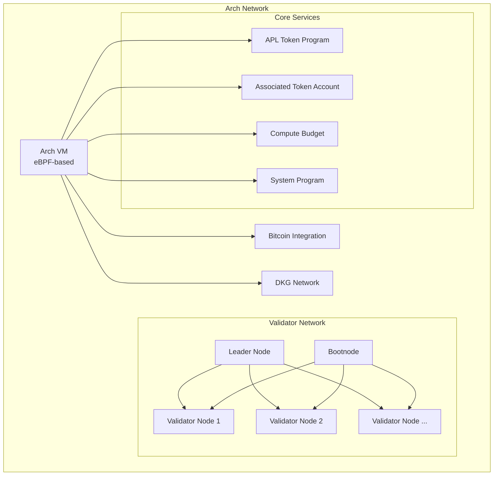
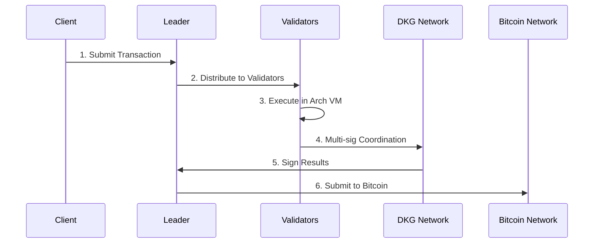

# Architecture Overview

## Core Components



### Arch VM
The Arch Virtual Machine (VM) is built on eBPF technology, providing a secure and efficient environment for executing programs.

Key features:
- 🔄 Manages program execution
- ⚡ Handles state transitions
- 🎯 Ensures deterministic computation
- 🔗 Provides syscalls for Bitcoin UTXO operations
- 💰 Supports compute budget management
- 🎭 Handles program upgrades and migrations

### Bitcoin Integration
Arch Network interacts directly with Bitcoin through:
- 💼 Native UTXO management via `bitcoin-internal` crate
- ✅ Transaction validation and synchronization
- 🔐 Multi-signature coordination
- 📝 State commitment to Bitcoin
- 🔄 Real-time Bitcoin network monitoring
- 📊 UTXO graph processing and rollback support

### Distributed Key Generation (DKG)
The DKG system enables secure multi-signature operations:
- 🔑 Threshold signature schemes (t-of-n)
- 🌐 Peer-to-peer key generation
- 🔄 Dynamic participant management
- 🛡️ Malicious participant detection
- 📡 Network message routing and validation

### Validator Network
The validator network consists of multiple node types that work together:

#### Node Types

| Node Type | Primary Responsibilities |
|-----------|------------------------|
| **Leader Node** | • Coordinates transaction signing<br/>• Submits signed transactions to Bitcoin<br/>• Manages validator communication<br/>• Orchestrates DKG sessions |
| **Validator Nodes** | • Execute programs in the Arch VM<br/>• Validate transactions<br/>• Participate in multi-signature operations<br/>• Maintain network state<br/>• Contribute to DKG operations |
| **Bootnode** | • Handles initial network discovery<br/>• Similar to Bitcoin DNS seeds<br/>• Helps new nodes join the network<br/>• Manages peer information distribution |

### Core Programs
Arch Network includes several built-in programs that provide essential functionality:

#### APL Token Program
- 🪙 Fungible token creation and management
- 🔐 Multi-signature support
- ❄️ Account freezing and thawing
- 📊 Supply management and minting
- 🎭 Authority management and delegation

#### Associated Token Account (ATA)
- 🔗 Automatic token account creation
- 💰 Rent-exempt account management
- 🎯 Deterministic address derivation
- 🔄 Account lifecycle management

#### Compute Budget Program
- ⚡ Transaction compute unit management
- 💰 Fee calculation and optimization
- 🎯 Resource allocation control
- 📊 Performance monitoring

#### System Program
- 🏗️ Account creation and management
- 🔄 Ownership transfers
- 💰 Lamport management
- 🔗 UTXO anchoring

## Transaction Flow



## Security Model
Arch Network implements a robust multi-layered security model that directly leverages Bitcoin's security guarantees:

### 1. UTXO Security
- 🔒 **Ownership Verification**
  - Public key cryptography using secp256k1
  - BIP322 message signing for secure ownership proofs
  - Double-spend prevention through UTXO consumption tracking

- 🔗 **State Management**
  - State anchoring to Bitcoin transactions
  - Atomic state transitions with rollback capability
  - Cross-validator state consistency checks
  - Real-time UTXO graph validation

### 2. Transaction Security
```rust,ignore
pub struct SecurityParams {
    pub min_confirmations: u32,    // Required Bitcoin confirmations
    pub signature_threshold: u32,   // Multi-sig threshold
    pub timelock_blocks: u32,      // Timelock requirement
    pub max_witness_size: usize,   // Maximum witness data size
    pub dkg_timeout: Duration,     // DKG operation timeout
    pub malicious_threshold: u32,  // Malicious participant threshold
}
```

- 📝 **Multi-signature Validation**
  - ROAST protocol for distributed signing
  - Threshold signature scheme (t-of-n)
  - Malicious signer detection and removal
  - Binding factor verification for signature shares
  - Dynamic participant management

### 3. Network Security
- 🌐 **Peer Validation**
  - Authenticated peer discovery
  - Message integrity verification
  - Rate limiting and DoS protection
  - Network topology validation

- 🔄 **State Synchronization**
  - Consensus-driven state updates
  - Rollback capability for invalid states
  - Cross-validator state verification
  - Real-time conflict resolution

## Performance Characteristics

### Scalability
- 📈 **Horizontal Scaling**: Add more validators for increased throughput
- 🔄 **Parallel Processing**: Multiple transactions processed simultaneously
- 💾 **Efficient Storage**: Optimized data structures for fast access
- 🌐 **Network Optimization**: Efficient peer-to-peer communication

### Throughput
- ⚡ **High TPS**: Optimized for high transaction throughput
- 💰 **Low Latency**: Fast transaction confirmation
- 🔄 **Batch Processing**: Efficient handling of multiple operations
- 📊 **Resource Management**: Compute budget optimization

### Reliability
- 🛡️ **Fault Tolerance**: Continues operation despite node failures
- 🔄 **Recovery**: Automatic recovery from network partitions
- 📝 **Audit Trail**: Complete transaction history and state changes
- 🔍 **Monitoring**: Real-time performance and health monitoring

## Development Workflow

### Local Development
```bash
# Start complete local environment
arch-cli orchestrate start --local "$(pwd)"

# Use configuration profiles for different environments
arch-cli config create-profile dev --bitcoin-node-endpoint http://127.0.0.1:18443

# Deploy and test programs
arch-cli deploy target/deploy/
```

### Testing and Validation
- 🧪 **Unit Testing**: Individual component testing
- 🔄 **Integration Testing**: End-to-end workflow validation
- 🌐 **Network Testing**: Multi-node network simulation
- 📊 **Performance Testing**: Throughput and latency measurement

### Deployment
- 🚀 **Staged Rollouts**: Gradual feature deployment
- 🔄 **Rollback Capability**: Quick reversion to previous versions
- 📊 **Monitoring**: Real-time performance and error tracking
- 🔍 **Debugging**: Comprehensive logging and error reporting
