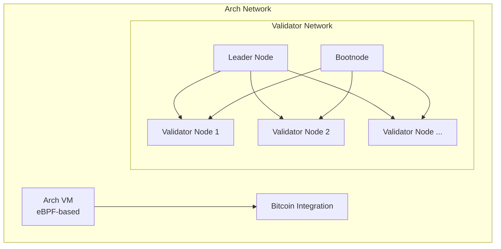
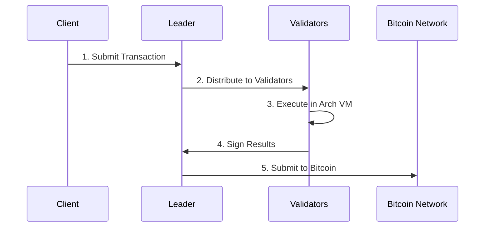

# Architecture Overview

## Core Components



### Arch VM
The Arch Virtual Machine (VM) is built on eBPF technology, providing a secure and efficient environment for executing programs.

Key features:
- 🔄 Manages program execution
- ⚡ Handles state transitions
- 🎯 Ensures deterministic computation
- 🔗 Provides syscalls for Bitcoin UTXO operations

### Bitcoin Integration
Arch Network interacts directly with Bitcoin through:
- 💼 Native UTXO management
- ✅ Transaction validation
- 🔐 Multi-signature coordination
- 📝 State commitment to Bitcoin

### Validator Network
The validator network consists of multiple node types that work together:

#### Node Types

| Node Type | Primary Responsibilities |
|-----------|------------------------|
| **Leader Node** | • Coordinates transaction signing<br/>• Submits signed transactions to Bitcoin<br/>• Manages validator communication |
| **Validator Nodes** | • Execute programs in the Arch VM<br/>• Validate transactions<br/>• Participate in multi-signature operations<br/>• Maintain network state |
| **Bootnode** | • Handles initial network discovery<br/>• Similar to Bitcoin DNS seeds<br/>• Helps new nodes join the network |

## Transaction Flow



## Security Model
Arch Network implements a robust multi-layered security model that directly leverages Bitcoin's security guarantees:

### 1. UTXO Security
- 🔒 **Ownership Verification**
  - Public key cryptography using secp256k1
  - BIP322 message signing for secure ownership proofs
  - Double-spend prevention through UTXO consumption tracking

- 🔗 **State Management**
  - State anchoring to Bitcoin transactions
  - Atomic state transitions with rollback capability
  - Cross-validator state consistency checks

### 2. Transaction Security
```rust,ignore
pub struct SecurityParams {
    pub min_confirmations: u32,    // Required Bitcoin confirmations
    pub signature_threshold: u32,   // Multi-sig threshold
    pub timelock_blocks: u32,      // Timelock requirement
    pub max_witness_size: usize    // Maximum witness data size
}
```

- 📝 **Multi-signature Validation**
  - ROAST protocol for distributed signing
  - Threshold signature scheme (t-of-n)
  - Malicious signer detection and removal
  - Binding factor verification for signature shares

### 3. Network Security
- 🌐 **Validator Selection**
  ```rust,ignore
  pub struct ValidatorSet {
      pub validators: Vec<ValidatorInfo>,
      pub threshold: u32
  }
  ```
  - Stake-weighted validator participation
  - Dynamic threshold adjustment
  - Automatic malicious node detection

- 🛡️ **State Protection**
  - Multi-stage transaction verification
  - Bitcoin-based finality guarantees
  - State root commitment to Bitcoin
  - Mandatory signature verification for all state changes

### 4. Best Practices
- ✅ **UTXO Management**
  - Minimum 6 confirmations for finality
  - Comprehensive UTXO validation
  - Double-spend monitoring
  - Reorg handling for UTXO invalidation

- 🔍 **Transaction Processing**
  - Full signature verification
  - Input/output validation
  - Proper error handling
  - Network partition handling

<!-- Internal -->
[nodes]: nodes.md
[program]: ../program/program.md
[utxo]: ../program/utxo.md

<!-- External -->
[eBPF]: https://ebpf.io/
