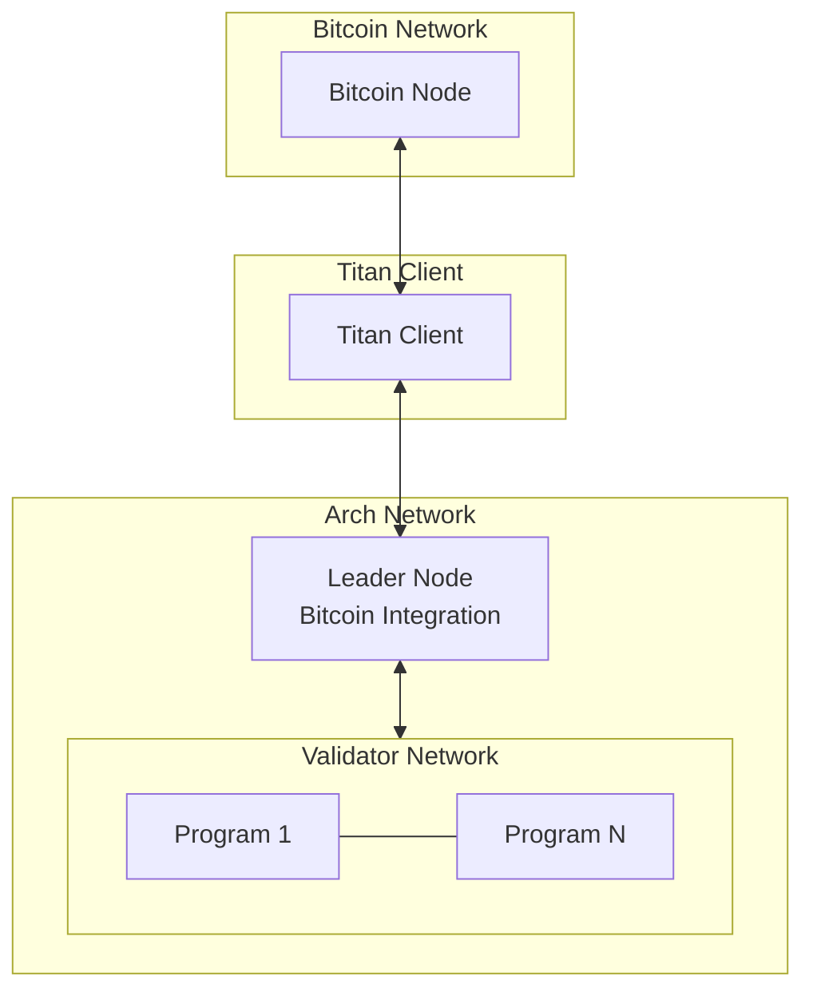
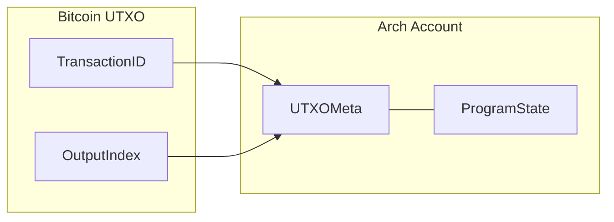
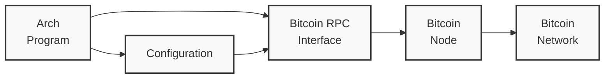
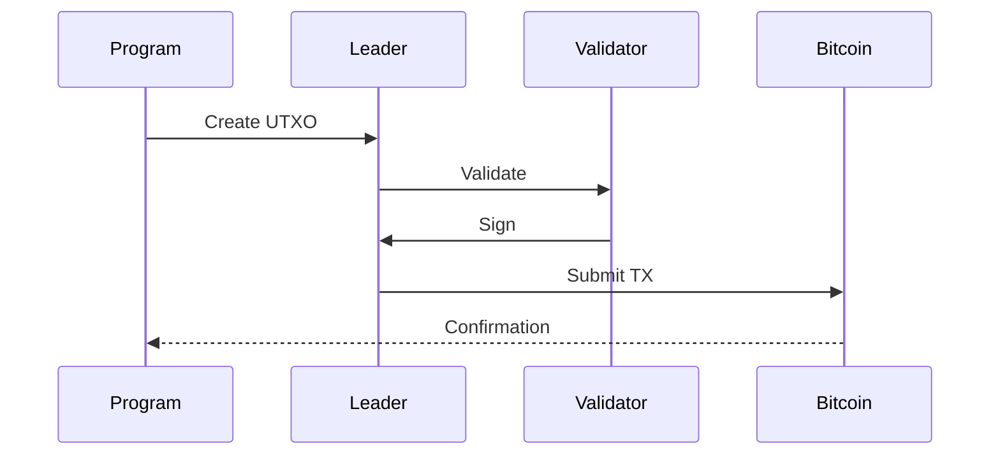

# Bitcoin Integration

Arch Network provides direct integration with Bitcoin, enabling programs to interact with Bitcoin's UTXO model while maintaining Bitcoin's security guarantees. This document details how Arch Network integrates with Bitcoin.

## Architecture Overview



## Core Components

### 1. UTXO Management
Arch Network manages Bitcoin UTXOs through a specialized system:



```rust,ignore
// UTXO Metadata Structure
pub struct UtxoMeta {
    pub txid: [u8; 32],  // Transaction ID
    pub vout: u32,       // Output index
    pub amount: u64,     // Amount in satoshis
    pub script_pubkey: Vec<u8>, // Output script
    pub confirmation_height: Option<u32>, // Block height of confirmation
}

// UTXO Account State
pub struct UtxoAccount {
    pub meta: UtxoMeta,
    pub owner: Pubkey,
    pub delegate: Option<Pubkey>,
    pub state: Vec<u8>,
    pub is_frozen: bool,
}
```

Key operations:
```rust,ignore
// UTXO Operations
pub trait UtxoOperations {
    fn create_utxo(meta: UtxoMeta, owner: &Pubkey) -> Result<()>;
    fn spend_utxo(utxo: &UtxoMeta, signature: &Signature) -> Result<()>;
    fn freeze_utxo(utxo: &UtxoMeta, authority: &Pubkey) -> Result<()>;
    fn delegate_utxo(utxo: &UtxoMeta, delegate: &Pubkey) -> Result<()>;
}
```

### 2. Bitcoin RPC Integration



Programs can interact with Bitcoin through RPC calls:
```rust,ignore
// Bitcoin RPC Configuration
pub struct BitcoinRpcConfig {
    pub endpoint: String,
    pub port: u16,
    pub username: String,
    pub password: String,
    pub wallet: Option<String>,
    pub network: BitcoinNetwork,
    pub timeout: Duration,
}

// RPC Interface
pub trait BitcoinRpc {
    fn get_block_count(&self) -> Result<u64>;
    fn get_block_hash(&self, height: u64) -> Result<BlockHash>;
    fn get_transaction(&self, txid: &Txid) -> Result<Transaction>;
    fn send_raw_transaction(&self, tx: &[u8]) -> Result<Txid>;
    fn verify_utxo(&self, utxo: &UtxoMeta) -> Result<bool>;
}
```

## Transaction Flow



### 1. Transaction Creation
```rust,ignore
// Create new UTXO transaction
pub struct UtxoCreation {
    pub amount: u64,
    pub owner: Pubkey,
    pub metadata: Option<Vec<u8>>,
}

impl UtxoCreation {
    pub fn new(amount: u64, owner: Pubkey) -> Self {
        Self {
            amount,
            owner,
            metadata: None,
        }
    }

    pub fn with_metadata(mut self, metadata: Vec<u8>) -> Self {
        self.metadata = Some(metadata);
        self
    }
}
```

### 2. Transaction Validation
```rust,ignore
// Validation rules
pub trait TransactionValidation {
    fn validate_inputs(&self, tx: &Transaction) -> Result<()>;
    fn validate_outputs(&self, tx: &Transaction) -> Result<()>;
    fn validate_signatures(&self, tx: &Transaction) -> Result<()>;
    fn validate_script(&self, tx: &Transaction) -> Result<()>;
}
```

### 3. State Management
```rust,ignore
// State transition
pub struct StateTransition {
    pub previous_state: Hash,
    pub next_state: Hash,
    pub utxos_created: Vec<UtxoMeta>,
    pub utxos_spent: Vec<UtxoMeta>,
    pub bitcoin_height: u64,
}
```

## Security Model

### 1. UTXO Security
- Ownership verification through public key cryptography
- Double-spend prevention through UTXO consumption
- State anchoring to Bitcoin transactions
- Threshold signature requirements

### 2. Transaction Security
```rust,ignore
// Transaction security parameters
pub struct SecurityParams {
    pub min_confirmations: u32,
    pub signature_threshold: u32,
    pub timelock_blocks: u32,
    pub max_witness_size: usize,
}
```

### 3. Network Security
- Multi-signature validation
- Threshold signing (t-of-n)
- Bitcoin-based finality
- Cross-validator consistency

## Error Handling

### 1. Bitcoin Errors
```rust,ignore
pub enum BitcoinError {
    ConnectionFailed(String),
    InvalidTransaction(String),
    InsufficientFunds(u64),
    InvalidUtxo(UtxoMeta),
    RpcError(String),
}
```

### 2. UTXO Errors
```rust,ignore
pub enum UtxoError {
    NotFound(UtxoMeta),
    AlreadySpent(UtxoMeta),
    InvalidOwner(Pubkey),
    InvalidSignature(Signature),
    InvalidState(Hash),
}
```

## Best Practices

### 1. UTXO Management
- Always verify UTXO ownership
- Wait for sufficient confirmations
- Handle reorganizations gracefully
- Implement proper error handling

### 2. Transaction Processing
- Validate all inputs and outputs
- Check signature thresholds
- Maintain proper state transitions
- Monitor Bitcoin network status

### 3. Security Considerations
- Protect private keys
- Validate all signatures
- Monitor for double-spend attempts
- Handle network partitions

<!-- Internal -->
[UTXO]: ../program/utxo.md
[Program]: ../program/program.md
[Instructions]: ../program/instructions-and-messages.md
[Network Architecture]: ./network-architecture.md 