# ROAST and FROST Consensus

This section explores Arch's consensus mechanism, which combines ROAST (Robust Asynchronous Schnorr Threshold Signatures) and FROST (Flexible Round-Optimized Schnorr Threshold Signatures) to create a secure, efficient, and highly scalable approach to distributed consensus that's perfectly suited for Bitcoin-based smart contracts.

## Implementation Status

The consensus mechanism implementation has made significant progress, particularly in the core cryptographic components:

1. **Implemented Components**
   - Complete Distributed Key Generation (DKG) protocol using FROST-secp256k1
   - Two-round DKG process with package handling
   - Network message protocol for DKG coordination
   - State management and status tracking
   - Integration with network layer
   - Error handling and recovery mechanisms

2. **In Progress**
   - Additional ROAST protocol components
   - Advanced state management features
   - Performance optimizations
   - Extended monitoring and telemetry

The subsequent sections describe both the implemented features and the complete protocol design.

## Core Implementation Details

### Distributed Key Generation (DKG)

```rust
// Core DKG message types for network coordination
pub enum DKGMessage {
    StartDKG { message: String },
    Round1Package { package: round1::Package },
    Round2Package { package: round2::Package },
    DKGStatus(DKGStatusMessage),
}

// DKG state management
pub enum DKGStatus {
    Pending(String),
    Ongoing(String),
    Failed(String, String),
    Finished(String),
    NetworkCompleted(String),
}
```

The DKG implementation provides:
- Two-round key generation protocol
- Secure package exchange between validators
- State tracking and synchronization
- Failure recovery and error handling

## TL;DR

Arch's consensus mechanism combines ROAST and FROST to provide a robust, Bitcoin-native consensus solution. Validators participate in a threshold signature scheme where blocks are produced by designated leaders and finalized through collective signing. The system maintains both safety and liveness through careful economic incentives and cryptographic guarantees, while ensuring complete compatibility with Bitcoin's Schnorr signature scheme.

## Block Production Process

### 1. Leader Selection

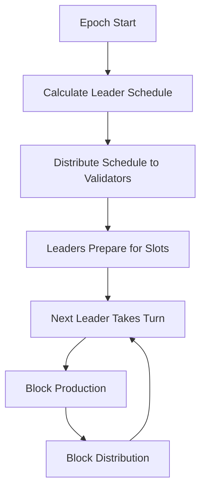

The block production process begins with leader selection:
- Each epoch (fixed time period) has a predetermined leader schedule
- Leaders are selected based on their stake weight
- The schedule is deterministic and known to all validators
- Multiple backup leaders are selected for fault tolerance

### 2. Transaction Collection and Verification

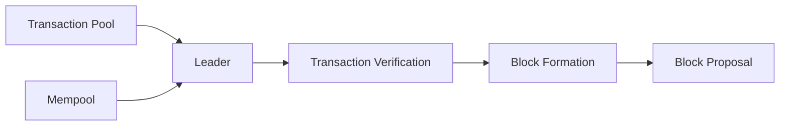

When a validator becomes the leader:
1. Collects pending transactions from the mempool
2. Verifies transaction signatures and validity
3. Orders transactions based on priority and fees
4. Prepares them for inclusion in the next block

### 3. Block Formation

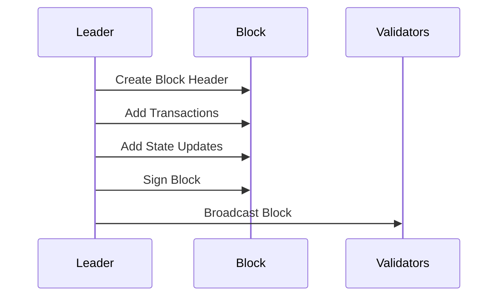

The block structure includes:
- Previous block reference
- Timestamp
- Transaction merkle root
- UTXO state updates
- Leader's signature

## Consensus Process

### 1. Block Validation

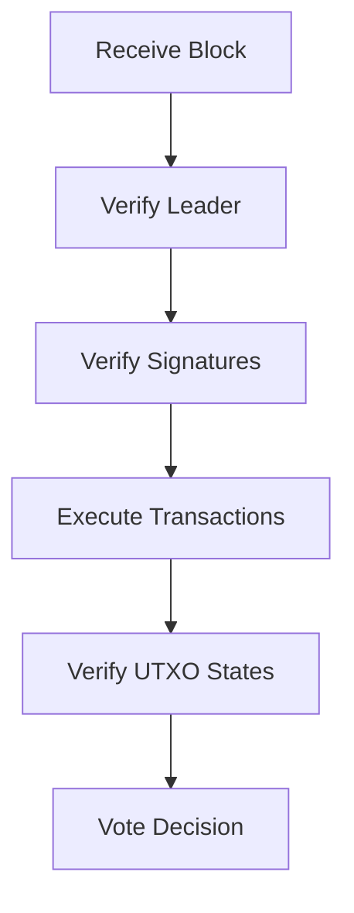

When validators receive a new block:
1. Verify the block producer is the designated leader
2. Validate all transaction signatures
3. Execute transactions and verify UTXO states
4. Check for any consensus rule violations

### 2. UTXO-Based State Management

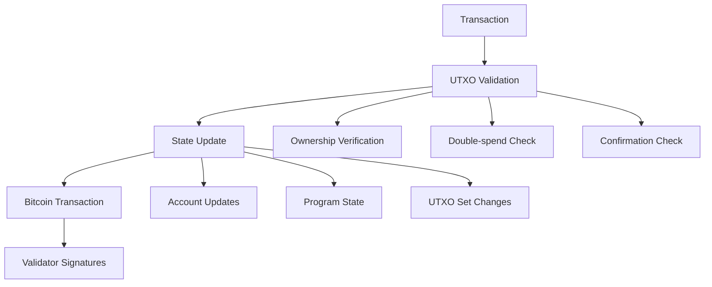

Arch's unique approach to state management leverages Bitcoin's UTXO model while extending it for smart contract functionality:

#### UTXO State Tracking
```rust
pub struct UtxoState {
    pub meta: UtxoMeta,          // UTXO identification
    pub status: UtxoStatus,      // Current UTXO status
    pub owner: Pubkey,           // UTXO owner
    pub created_at: i64,         // Creation timestamp
    pub spent_at: Option<i64>,   // Spend timestamp if spent
}

pub enum UtxoStatus {
    Pending,    // Waiting for confirmations
    Active,     // Confirmed and spendable
    Spent,      // UTXO has been consumed
    Invalid,    // UTXO was invalidated (e.g., by reorg)
}
```

#### State Transition Process
1. **UTXO Validation**
   - Verify UTXO existence on Bitcoin
   - Check confirmation requirements (typically 6+)
   - Validate ownership and spending conditions
   - Prevent double-spending attempts

2. **State Updates**
   - Atomic account data modifications
   - Program state transitions
   - UTXO set updates
   - Cross-validator state consistency

3. **Bitcoin Integration**
   - State anchoring to Bitcoin transactions
   - Threshold signature aggregation
   - Transaction finality through Bitcoin confirmations
   - Reorg handling and state rollbacks

#### Security Properties
- **Ownership Verification**
  * Public key cryptography using secp256k1
  * BIP322 message signing for ownership proofs
  * Threshold signature requirements

- **Double-spend Prevention**
  * UTXO consumption tracking
  * Cross-validator consistency checks
  * Bitcoin-based finality guarantees

- **State Protection**
  * Atomic state transitions
  * Rollback capability for reorgs
  * State root commitments
  * Multi-stage verification

#### Performance Optimizations
- UTXO caching for frequent access
- Batch processing of state updates
- Parallel transaction validation
- Efficient UTXO lookup mechanisms

This UTXO-based approach provides several advantages:
1. Direct compatibility with Bitcoin's security model
2. Natural support for atomic operations
3. Clear ownership and state transition rules
4. Built-in protection against double-spending
5. Simplified state verification and rollback

### 3. FROST Signing Process

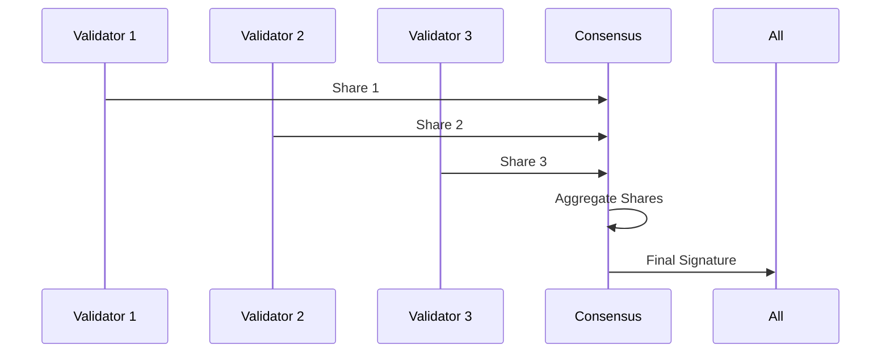

The FROST signing process involves:
1. Each validator generates their partial signature
2. Signatures are shared among the threshold group
3. Partial signatures are aggregated into a final signature
4. The aggregated signature is verified against the group public key

### 4. ROAST Enhancement Layer

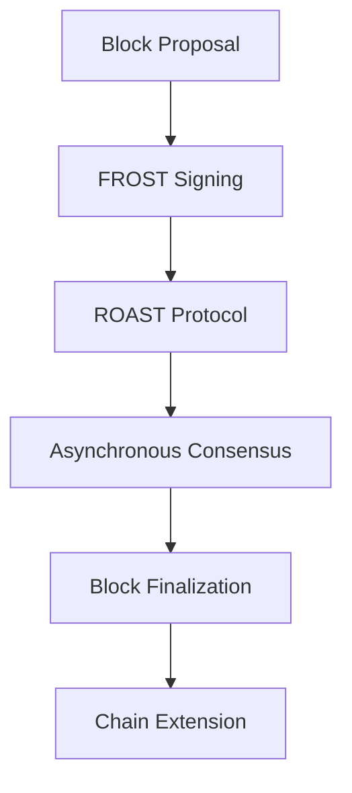

ROAST transforms FROST into a production-ready consensus mechanism by adding several crucial enhancements:

#### Asynchronous Operation Guarantees

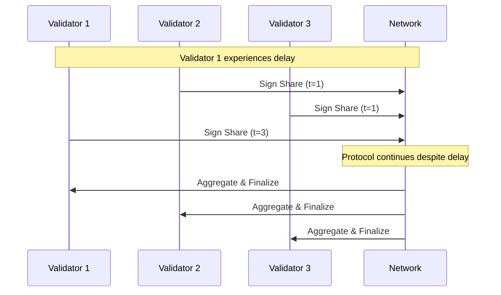

Unlike traditional consensus mechanisms that require strict synchronization:
- Validators can participate in signing rounds without tight timing constraints
- The protocol progresses even when some validators are temporarily delayed
- Network partitions and varying message delivery times are handled gracefully
- No assumptions about network synchrony are required for safety

#### Byzantine Fault Tolerance

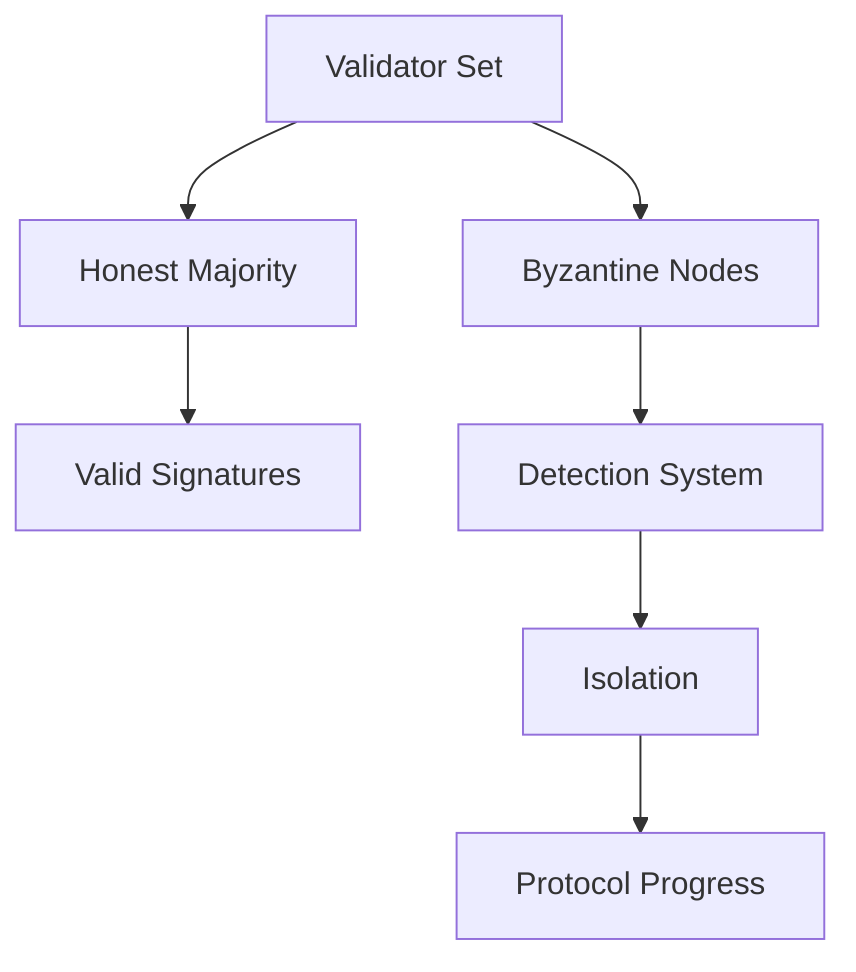

ROAST maintains safety and liveness even in the presence of malicious actors:
- Tolerates up to f Byzantine validators where f < n/3
- Malicious behavior is detected and isolated
- Signature shares from Byzantine validators can be identified and excluded
- The protocol remains secure even if Byzantine validators:
  * Submit invalid signature shares
  * Attempt to sign conflicting blocks
  * Try to delay or prevent consensus
  * Collude with other malicious validators

#### Leader Rotation Mechanism

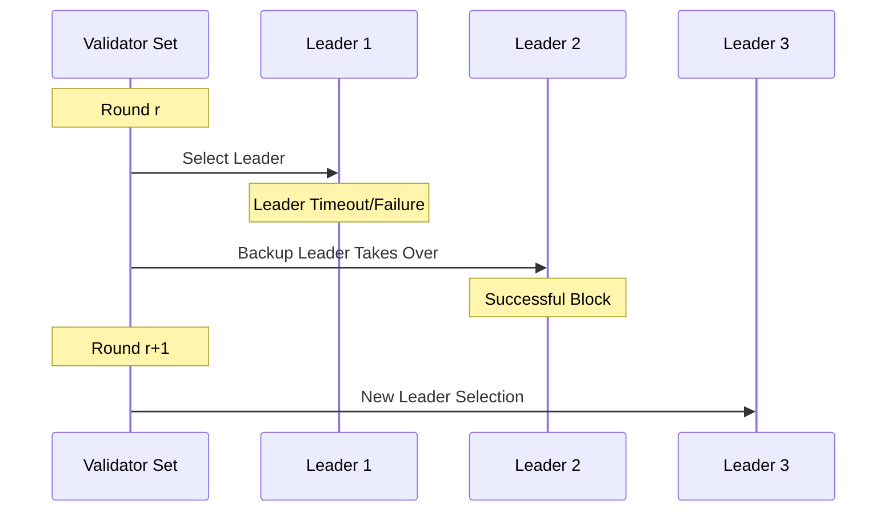

ROAST implements a robust leader rotation system that:
- Deterministically selects leaders based on stake weight and randomness
- Automatically rotates leaders to prevent centralization
- Provides backup leaders in case of primary leader failure
- Ensures fair distribution of block production opportunities
- Maintains progress even when leaders fail or misbehave

#### Liveness Guarantees

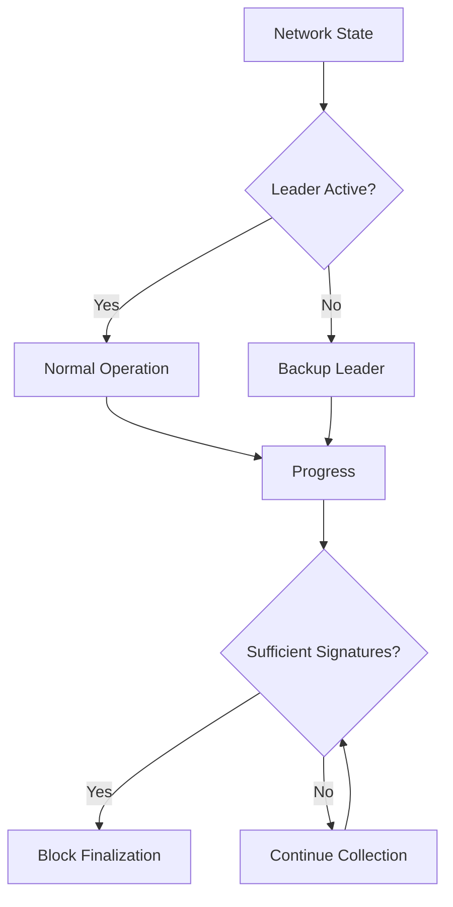

ROAST ensures the network continues to make progress through several mechanisms:
1. **View Synchronization**
   - Validators maintain a consistent view of network state
   - Recovery procedures for missed blocks or state updates
   - Automatic resynchronization after network partitions

2. **Failure Recovery**
   - Automatic detection of failed validators
   - Seamless transition to backup leaders
   - Recovery from temporary network failures
   - Rejoining procedures for validators that fall behind

3. **Progress Conditions**
   - Guaranteed block finalization when sufficient honest validators participate
   - No single validator can prevent progress
   - Continued operation during validator churn
   - Resilient to temporary network issues

4. **Deadlock Prevention**
   - No waiting for specific validators
   - Timeout mechanisms for unresponsive participants
   - Alternative paths for consensus when optimal path fails
   - Dynamic adjustment of protocol parameters

These enhancements make ROAST particularly well-suited for production environments where:
- Network conditions are unpredictable
- Validators may join or leave the network
- Malicious actors may attempt to disrupt consensus
- High availability and reliability are required

## Fork Resolution

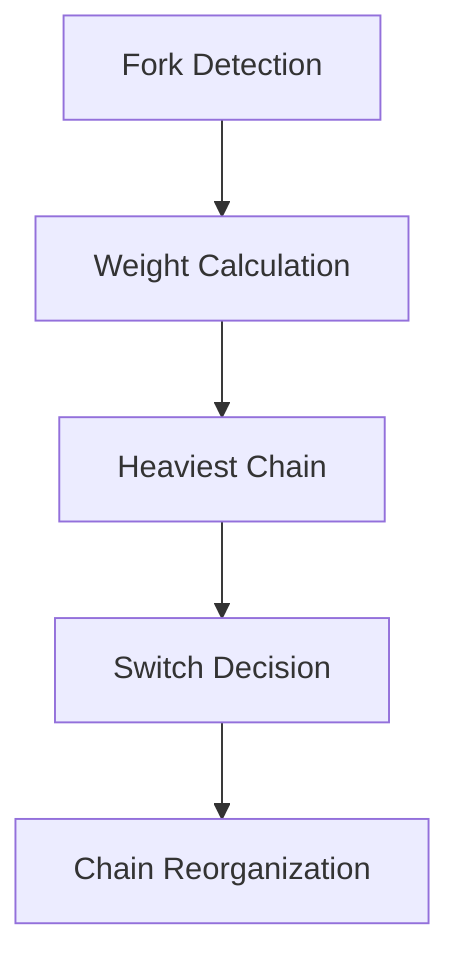

When forks occur:
1. Validators identify competing chains
2. Calculate the weight of each fork based on stake
3. Apply the heaviest-chain rule
4. Coordinate chain reorganization if needed

## Understanding FROST

FROST is a threshold signature scheme that enables a group of participants to collectively generate Schnorr signatures. This foundational protocol is crucial for Arch's consensus mechanism because it provides a way to achieve distributed agreement while maintaining compatibility with Bitcoin's native signature scheme.

### Key Components

- **Distributed Key Generation**: Validators collectively participate in a process that generates a shared public key while keeping individual private key shares separate and secure.
- **Threshold Signatures**: The system requires a specific number of validators (t-of-n) to cooperate in order to produce valid signatures, balancing security with fault tolerance.
- **Share Management**: Each validator maintains their own private key share, contributing to the system's security through distribution of trust.
- **Signature Aggregation**: Multiple partial signatures are combined into a single Schnorr signature that's indistinguishable from a standard single-signer signature.

### Benefits of FROST

1. **Enhanced Security**
   - No single validator can compromise the system
   - Distributed trust model eliminates single points of failure
   - Cryptographic guarantees of signature validity

2. **Bitcoin Compatibility**
   - Native integration with Bitcoin's Schnorr signature scheme
   - No additional on-chain overhead
   - Seamless interaction with Bitcoin's transaction validation

3. **Efficiency**
   - Constant-size signatures regardless of validator count
   - Optimized communication patterns
   - Reduced blockchain space usage

## ROAST: Enhancing FROST for Production

While FROST provides the cryptographic foundation, ROAST adds crucial properties needed for real-world deployment in adversarial environments. ROAST transforms FROST from a theoretical protocol into a production-ready consensus mechanism.

### Key Enhancements

1. **Asynchronous Operation**
   - Validators can participate without strict timing requirements
   - Resilient to network delays and partitions
   - Maintains liveness in real-world conditions

2. **Robustness Against Attacks**
   - Continues operating even with malicious participants
   - Detects and handles various forms of validator misbehavior
   - Provides provable security guarantees

3. **Leader Selection**
   - Efficient and fair leader rotation mechanism
   - Prevents centralization of power
   - Maintains system progress even if leaders fail

4. **Liveness Guarantees**
   - Ensures forward progress under adverse conditions
   - Handles validator churn gracefully
   - Recovers automatically from temporary failures

## Arch's Novel Implementation

Arch's implementation of ROAST/FROST represents a significant innovation in the blockchain space, particularly for Bitcoin-based smart contract platforms.

### Unique Features

1. **Bitcoin-Native Design**
   - Optimized for Bitcoin's specific constraints and capabilities
   - Leverages Bitcoin's security model
   - Minimizes on-chain footprint

2. **Smart Contract Integration**
   - Seamless combination with programmable logic
   - Maintains Bitcoin's security guarantees
   - Enables complex decentralized applications

3. **Scalable State Management**
   - Efficient handling of state transitions
   - Parallel transaction processing where possible
   - Optimized validator resource usage

4. **Economic Security**
   - Carefully designed incentive structure
   - Slashing conditions for misbehavior
   - Aligned validator and network interests

### Performance Characteristics

- **Throughput**: High transaction processing capacity without sacrificing decentralization
- **Latency**: Optimized confirmation times while maintaining security
- **Resource Usage**: Efficient use of network and computational resources
- **Scalability**: Linear scaling with validator count for most operations

## Security Considerations

### Threat Model

- **Byzantine Validators**: System remains secure with up to f Byzantine validators (where f < n/3)
- **Network Adversaries**: Resilient against various network-level attacks
- **Cryptographic Security**: Based on well-studied cryptographic assumptions

### Security Properties

1. **Safety**
   - No conflicting transactions can be confirmed
   - Cryptographic guarantees of transaction finality
   - Protection against double-spending

2. **Liveness**
   - System continues to make progress
   - Recovers from temporary failures
   - Handles validator set changes

3. **Fault Tolerance**
   - Continues operating with partial validator failures
   - Graceful degradation under attack
   - Automatic recovery mechanisms

## Future Directions

The ROAST/FROST consensus mechanism in Arch provides a solid foundation for future enhancements:

1. **Scalability Improvements**
   - Research into further optimization of signature aggregation
   - Investigation of layer-2 scaling solutions
   - Exploration of parallel processing techniques

2. **Security Enhancements**
   - Ongoing cryptographic research
   - Additional protection against emerging threats
   - Enhanced monitoring and detection systems

3. **Feature Extensions**
   - Support for more complex smart contract patterns
   - Enhanced cross-chain interoperability
   - Advanced state management techniques

## Further Reading

### Academic Papers and Research

#### FROST (Flexible Round-Optimized Schnorr Threshold Signatures)
- [FROST: Flexible Round-Optimized Schnorr Threshold Signatures](https://eprint.iacr.org/2020/852.pdf) - The original FROST paper by Chelsea Komlo and Ian Goldberg
- [Two-Round Threshold Schnorr Signatures with FROST](https://eprint.iacr.org/2021/1110.pdf) - An optimized two-round variant of FROST
- [Implementing FROST](https://github.com/ZcashFoundation/frost) - Reference implementation by the Zcash Foundation

#### ROAST (Robust Asynchronous Schnorr Threshold Signatures)
- [ROAST: Robust Asynchronous Schnorr Threshold Signatures](https://eprint.iacr.org/2022/550.pdf) - The foundational ROAST paper
- [Practical Threshold Signatures for Bitcoin](https://medium.com/blockstream/implementing-threshold-signatures-for-bitcoin-8d3b63831325) - Implementation insights for Bitcoin-based threshold signatures

#### Threshold Cryptography and Consensus
- [A Survey of Distributed Consensus Protocols for Blockchain Networks](https://arxiv.org/pdf/1904.04098.pdf) - Comprehensive overview of consensus mechanisms
- [Threshold Signatures: The Future of Consensus?](https://eprint.iacr.org/2019/1157.pdf) - Analysis of threshold signatures in consensus protocols
- [Schnorr Multi-Signatures and Applications](https://eprint.iacr.org/2018/068.pdf) - Foundational work on Schnorr multi-signatures

### Technical Resources

#### Implementation Guides
- [BIP 340: Schnorr Signatures for secp256k1](https://github.com/bitcoin/bips/blob/master/bip-0340.mediawiki) - Bitcoin Improvement Proposal for Schnorr signatures
- [Implementing Threshold Signatures](https://tlu.tarilabs.com/cryptography/threshold-signatures) - Technical guide on threshold signature implementation
- [Multi-Party Computation for Distributed Key Generation](https://github.com/ZcashFoundation/redjubjub) - Reference implementation of distributed key generation

#### Security Analysis
- [Security Analysis of Threshold Signature Schemes](https://eprint.iacr.org/2019/114.pdf) - Comprehensive security analysis
- [Formal Verification of FROST](https://eprint.iacr.org/2021/1559.pdf) - Formal security proofs for FROST
- [Byzantine Fault Tolerance in Distributed Systems](https://arxiv.org/pdf/1908.01738.pdf) - Analysis of BFT in consensus protocols

### Community Resources
- [FROST Working Group](https://frost.zfnd.org) - Community working group on FROST implementation
- [Bitcoin Dev Mailing List](https://lists.linuxfoundation.org/pipermail/bitcoin-dev/) - Discussions on threshold signatures in Bitcoin

## Conclusion

The combination of ROAST and FROST in Arch represents a significant advancement in Bitcoin-based smart contract platforms. This consensus mechanism enables sophisticated applications while maintaining the security and decentralization principles that make Bitcoin valuable. Through careful design and implementation, Arch has created a system that is not just theoretically sound but practically deployable and scalable for real-world applications.
