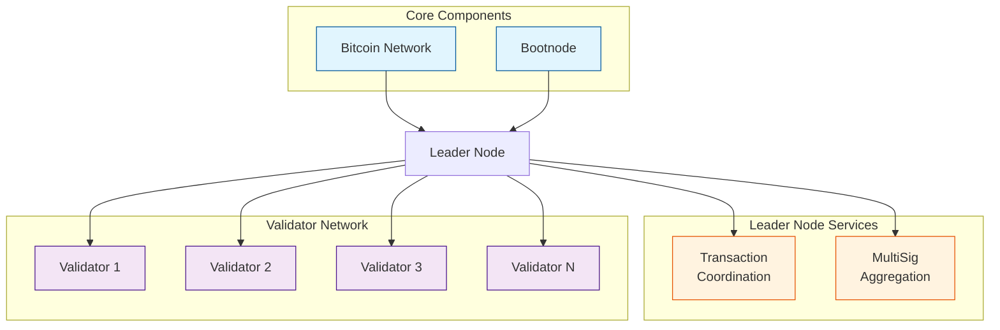
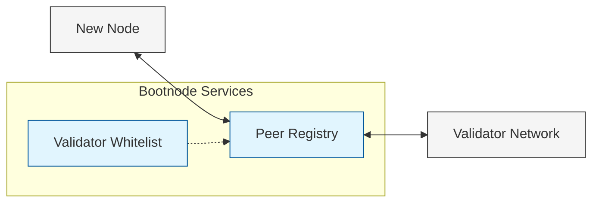
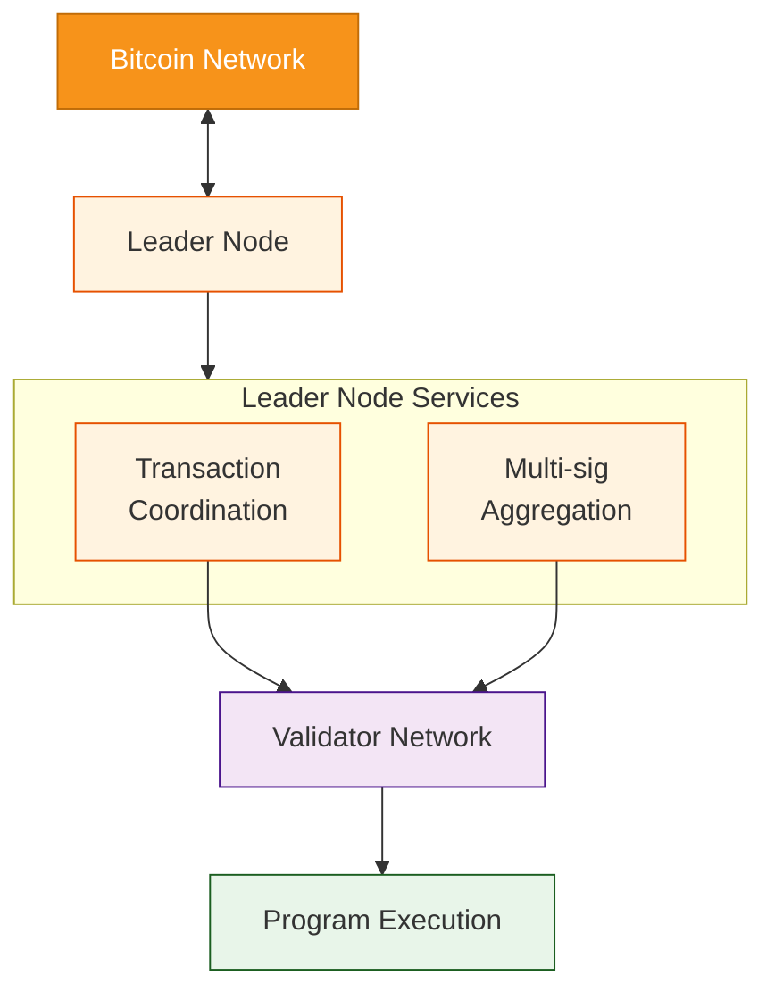
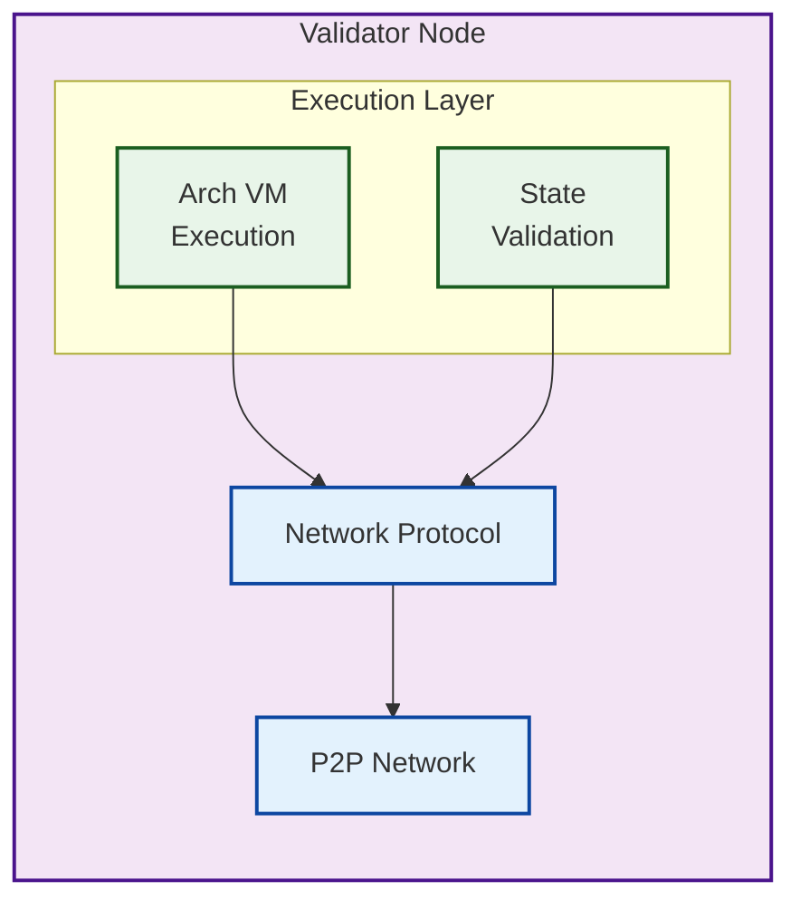

# Network Architecture

Arch Network operates as a distributed system with different types of nodes working together to provide secure and efficient program execution on Bitcoin. This document details the network's architecture and how different components interact.

## Network Overview



## Node Types

### 1. Bootnode
The bootnode serves as the network's entry point, similar to DNS seeds in Bitcoin:
- Handles initial network discovery
- Maintains whitelist of valid validators
- Coordinates peer connections
- Manages network topology



Configuration:
```bash
cargo run -p bootnode -- \
    --network-mode localnet \
    --p2p-bind-port 19001 \
    --leader-peer-id "<LEADER_ID>" \
    --validator-whitelist "<VALIDATOR_IDS>"
```

### 2. Leader Node
The leader node coordinates transaction processing and Bitcoin integration:



Key responsibilities:
- Transaction coordination
- Multi-signature aggregation
- Bitcoin transaction submission
- Network state management

### 3. Validator Nodes
Validator nodes form the core of the network's computation and validation:



Types:
1. **Full Validator**
   - Participates in consensus
   - Executes programs
   - Maintains full state

2. **Lightweight Validator**
   - Local development use
   - Single-node operation
   - Simulated environment

## Network Communication

### P2P Protocol
The network uses libp2p for peer-to-peer communication:
```rust,ignore
pub const ENABLED_PROTOCOLS: [&str; 2] = [
    ArchNetworkProtocol::STREAM_PROTOCOL,
    ArchNetworkProtocol::VALIDATOR_PROTOCOL,
];

// Protocol versions
pub const PROTOCOL_VERSION: &str = "/arch/1.0.0";
pub const VALIDATOR_VERSION: &str = "/arch/validator/1.0.0";
```

### Message Types
1. **Network Messages**
   ```rust,ignore
   pub enum NetworkMessage {
       Discovery(DiscoveryMessage),
       State(StateMessage),
       Transaction(TransactionMessage),
   }
   ```

2. **ROAST Protocol Messages**
   ```rust,ignore
   pub enum RoastMessage {
       KeyGeneration(KeyGenMessage),
       Signing(SigningMessage),
       Aggregation(AggregationMessage),
   }
   ```

## Network Modes

### 1. Devnet
- Local development environment
- Single validator setup
- Simulated Bitcoin interactions
- Fast block confirmation

### 2. Testnet
- Test environment with multiple validators
- Bitcoin testnet integration
- Real network conditions
- Test transaction processing

### 3. Mainnet
- Production network
- Full security model
- Bitcoin mainnet integration
- Live transaction processing

## Security Model

### 1. Validator Selection
```rust,ignore
pub struct ValidatorInfo {
    pub peer_id: PeerId,
    pub pubkey: Pubkey,
    pub stake: u64,
}

pub struct ValidatorSet {
    pub validators: Vec<ValidatorInfo>,
    pub threshold: u32,
}
```

### 2. Transaction Security
- Multi-signature validation using ROAST protocol
- Threshold signing (t-of-n)
- Bitcoin-based finality
- Double-spend prevention

### 3. State Protection
```rust,ignore
pub struct StateUpdate {
    pub block_height: u64,
    pub state_root: Hash,
    pub bitcoin_height: u64,
    pub signatures: Vec<Signature>,
}
```

## Monitoring and Telemetry

### 1. Node Metrics
```rust,ignore
pub struct NodeMetrics {
    pub peer_id: PeerId,
    pub network_mode: ArchNetworkMode,
    pub bitcoin_block_height: u64,
    pub arch_block_height: u64,
    pub peers_connected: u32,
    pub transactions_processed: u64,
    pub program_count: u32,
}
```

### 2. Network Health
```rust,ignore
pub struct NetworkHealth {
    pub validator_count: u32,
    pub active_validators: u32,
    pub network_tps: f64,
    pub average_block_time: Duration,
    pub fork_count: u32,
}
```

### 3. Monitoring Endpoints
- `/metrics` - Prometheus metrics
- `/health` - Node health check
- `/peers` - Connected peers
- `/status` - Network status

## Best Practices

### 1. Node Operation
- Secure key management
- Regular state verification
- Proper shutdown procedures
- Log management

### 2. Network Participation
- Maintain node availability
- Monitor Bitcoin integration
- Handle network upgrades
- Backup critical data

### 3. Development Setup
- Use lightweight validator for testing
- Monitor resource usage
- Handle network modes properly
- Implement proper error handling

<!-- Internal -->
[Arch VM]: ./arch-vm.md
[Bitcoin Integration]: ./bitcoin-integration.md
[UTXO]: ../program/utxo.md
[Program]: ../program/program.md 