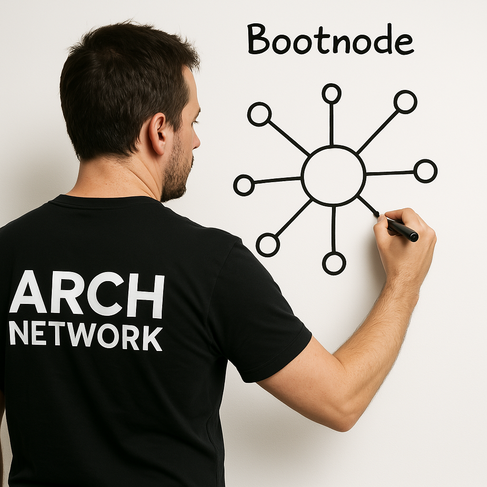

# Nodes

Let's introduce the nodes that comprise the Arch Network stack in greater detail.

[Bootnode]

The bootnode works similarly to DNS seeds in Bitcoin whereby the server handles the first connection to nodes joining the Arch Network.

[Leader]

All signing is coordinated by the leader. Ultimately, the leader submits signed Bitcoin transactions to the Bitcoin network following program execution.
    
[Validator]
  
This node represents a generic node operated by another party. It performs the validator role and has a share in the network's distributed signing key. The leader node passes transactions to validator nodes to validate and sign. After enough signatures have been collected (a threshold has been met), the leader can then submit a fully signed Bitcoin transaction to the Bitcoin network.

The validator node also runs the [eBPF] virtual machine and executes the transactions asynchronously alongside the other validator nodes in the network.

[Lightweight Validator]

This validator is a lightweight server that only serves as an RPC for developers to get up and running quickly with the least amount of overhead. It simulates a single-node blockchain environment that is meant for efficient, rapid development.

> Note: the [Lightweight Validator] node uses the same image as the [Validator] node though operates singularly for maximum efficiency. You can start a lightweight validator using the `arch-cli validator start` command.
 
More can be read about the Arch Network architecture in our [docs].

<!-- External -->
[docs]: https://docs.arch.network
[eBPF]: https://ebpf.io/
[Bootnode]: https://github.com/Arch-Network/arch-node
[Leader]: https://github.com/Arch-Network/arch-node
[Validator]: https://github.com/Arch-Network/arch-node
[Lightweight Validator]: https://github.com/Arch-Network/arch-node
