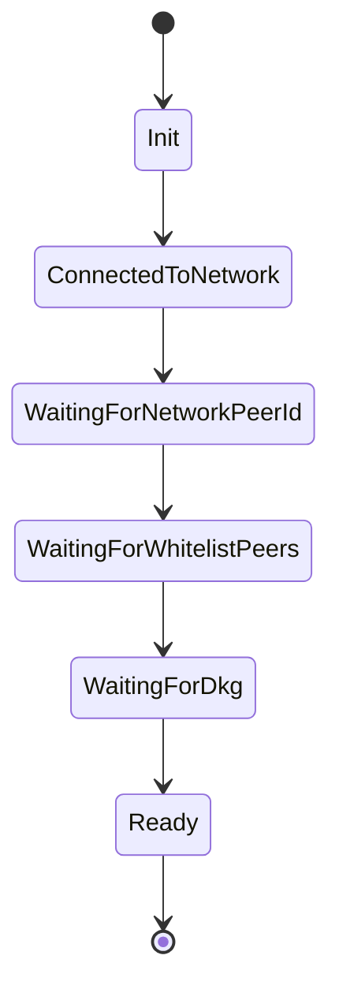
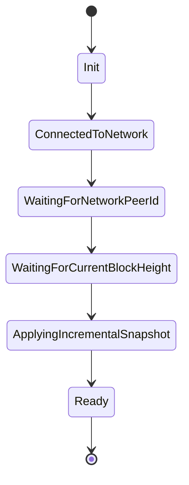

# Validator State Machine

This document describes the complete state machine for Arch Network validators, including all possible states and their transitions.

## 📊 State Diagram Overview

The validator follows two main paths depending on whether Distributed Key Generation (DKG) has been completed:

- **DKG Path**: For new validators that need to generate keys
- **Sync Path**: For existing validators that need to synchronize with the network

Both paths converge at the `Ready` state where validators can participate in consensus.

## 🔄 Validator States

### Initial States

#### `Init`
- **Purpose**: Starting state when validator first boots up
- **Transitions to**: `ConnectedToNetwork`
- **Trigger**: Network connection is established

#### `ConnectedToNetwork`
- **Purpose**: Network connection established, preparing for peer discovery
- **Transitions to**: `WaitingForNetworkPeerId`
- **Trigger**: Peers discovered and topics subscribed

#### `WaitingForNetworkPeerId`
- **Purpose**: Waiting for network peer information from bootnode
- **Transitions to**: 
  - `WaitingForWhitelistPeers` (if DKG not completed)
  - `WaitingForCurrentBlockHeight` (if DKG already completed)
  - `WaitingForNetworkPeerId` (retry on timeout)
- **Trigger**: Bootnode responds with network peer information

### DKG Path (Network just started)

#### `WaitingForWhitelistPeers`
- **Purpose**: Waiting for all required whitelist peers to connect, this is required since DKG requires a full mesh network
- **Transitions to**: `WaitingForDkg`
- **Trigger**: All whitelist peers are connected

#### `WaitingForDkg`
- **Purpose**: Distributed Key Generation process is running
- **Transitions to**: `Ready`
- **Trigger**: DKG completes successfully and keys are generated

### Synchronization Module (Block generation is already in progress)

#### `WaitingForCurrentBlockHeight`
- **Purpose**: Requesting and analyzing current block height from network peers
- **Transitions to**:
  - `Ready` (if already synchronized)
  - `ApplyingFullSnapshot` (if full sync needed)
  - `ApplyingIncrementalSnapshot` (if incremental sync needed)
  - `WaitingForCurrentBlockHeight` (retry on failure)
- **Trigger**: All peers sent responses, or request timed out

#### `ApplyingFullSnapshot`
- **Purpose**: Downloading and applying a complete network snapshot
- **Transitions to**:
  - `Ready` (if sync completes successfully)
  - `ApplyingIncrementalSnapshot` (if incremental sync needed after)
  - `ApplyingFullSnapshot` (retry/continue same snapshot)
- **Trigger**: Snapshot application completes or full snapshot acquisition fails

#### `ApplyingIncrementalSnapshot`
- **Purpose**: Downloading and applying incremental block data
- **Transitions to**:
  - `Ready` (if sync completes successfully)
  - `ApplyingIncrementalSnapshot` (continue syncing)
  - `WaitingForCurrentBlockHeight` (retry/restart sync)
- **Trigger**: Incremental sync completes or requires restart

### Final States

#### `Ready`
- **Purpose**: 🎯 **FINAL STATE** - Validator is synchronized and can participate in consensus
- **Transitions to**:
  - `WaitingForCurrentBlockHeight` (if the validator somehow falls out of sync)
  - `Ready` (state refresh)
- **Trigger**: Node falls behind network or needs re-synchronization

#### `Listening`
- **Purpose**: 🎯 **FINAL STATE FOR LISTENER NODES** - Non-participating node that only observes
- **Transitions to**:
  - `WaitingForCurrentBlockHeight` (if sync required)
  - `Ready` (if promoted to full validator)
- **Note**: ⚠️ **For listener nodes, `Listening` is the final state instead of `Ready`**

## 🔄 Retry and Recovery Patterns

### Automatic Retries
- **`WaitingForNetworkPeerId`**: Retries on timeout
- **`WaitingForCurrentBlockHeight`**: Retries on sync strategy failure
- **`ApplyingFullSnapshot`**: Can retry or switch to incremental
- **`ApplyingIncrementalSnapshot`**: Can retry or restart sync

### Recovery Strategies
- **Network Failures**: Automatic reconnection and peer rediscovery
- **Sync Failures**: Fallback to full snapshot if incremental fails
- **DKG Failures**: Restart DKG process with current peer set
- **State Corruption**: Reset to last known good state

## 🚀 State Transition Examples

### New Validator Joining Network



### Existing Validator Reconnecting



## 🔧 Monitoring and Debugging

### State Monitoring
```bash
# Check validator status
arch-cli orchestrate validator-status

# View validator logs
docker logs arch-validator

# Check network connectivity
arch-cli get-block-height
```

### Common State Issues

#### Stuck in `WaitingForNetworkPeerId`
- **Cause**: Bootnode not responding or network issues
- **Solution**: Check network connectivity and bootnode status

#### Stuck in `WaitingForWhitelistPeers`
- **Cause**: Not all required peers are connected
- **Solution**: Verify peer configuration and network topology

#### Stuck in `WaitingForDkg`
- **Cause**: DKG process hanging or failing
- **Solution**: Check DKG logs and peer connectivity

#### Stuck in Sync States
- **Cause**: Network partition or corrupted state
- **Solution**: Reset validator and restart sync process

## 📊 Performance Characteristics

### State Transition Times
- **`Init` → `ConnectedToNetwork`**: < 1 second
- **`ConnectedToNetwork` → `WaitingForNetworkPeerId`**: 1-5 seconds
- **`WaitingForNetworkPeerId` → `WaitingForWhitelistPeers`**: 5-30 seconds
- **`WaitingForWhitelistPeers` → `WaitingForDkg`**: 10-60 seconds
- **`WaitingForDkg` → `Ready`**: 1-5 minutes
- **Sync states**: Variable based on network size and state

### Resource Requirements
- **Memory**: Increases during sync, stabilizes at `Ready`
- **CPU**: High during DKG and sync, low at `Ready`
- **Network**: High bandwidth during sync, moderate at `Ready`
- **Storage**: Grows with network state size

## 🛡️ Security Considerations

### State Validation
- **Peer Authentication**: Verify peer identities before state transitions
- **State Integrity**: Validate all received state data
- **DKG Security**: Ensure proper threshold signature setup

### Attack Prevention
- **Sybil Attacks**: Whitelist-based peer validation
- **State Corruption**: Cryptographic verification of snapshots
- **Network Partition**: Automatic detection and recovery

## 🔄 Best Practices

### Configuration
1. **Peer Configuration**: Set appropriate whitelist peers
2. **Timeout Values**: Configure reasonable timeout values
3. **Retry Limits**: Set appropriate retry limits for each state
4. **Logging**: Enable detailed logging for debugging

### Monitoring
1. **State Tracking**: Monitor state transitions
2. **Performance Metrics**: Track transition times
3. **Error Rates**: Monitor failure rates for each state
4. **Resource Usage**: Track resource consumption

### Troubleshooting
1. **Log Analysis**: Review logs for error patterns
2. **Network Diagnosis**: Check network connectivity
3. **Peer Validation**: Verify peer configuration
4. **State Reset**: Reset validator if stuck in bad state

## 📚 Related Documentation

- [Network Architecture](network-architecture.md) - Understanding network topology
- [Bitcoin Integration](bitcoin-integration.md) - Bitcoin network integration
- [Consensus Protocol](consensus.md) - ROAST and FROST consensus
- [Validator Setup](../getting-started/bitcoin-and-titan-setup.md) - Setting up validators
- [CLI Reference](../guides/arch-cli-reference.md) - Managing validators via CLI
