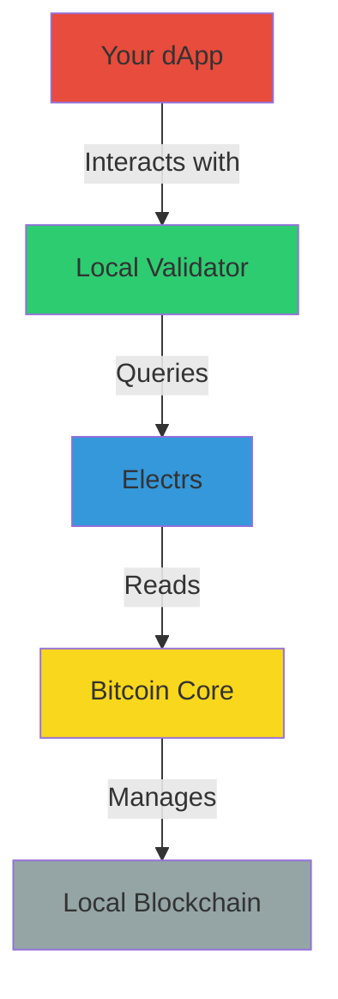

# 🔗 Setting up Bitcoin Core and Electrs

Welcome to the detailed component setup guide! Here we'll walk through setting up Bitcoin Core and Electrs, the foundational components for your Arch Network development environment.

## 🎯 What We're Building



### 🧩 Understanding the Components

#### Bitcoin Core 🏦
- Your personal Bitcoin node
- Manages a local blockchain in regtest mode
- Perfect for development - create test Bitcoin at will!

#### Electrs ⚡
- Lightning-fast Bitcoin data indexer
- Makes blockchain queries super efficient
- Essential for real-time dApp responses

## 📋 Progress Tracker
- [ ] Install Bitcoin Core dependencies
- [ ] Build Bitcoin Core
- [ ] Configure Bitcoin Core
- [ ] Test Bitcoin Core
- [ ] Build Electrs
- [ ] Configure Electrs
- [ ] Test the full stack

## 1. 🏗️ Bitcoin Core Setup

### 1.1 Installing Dependencies

Choose your operating system:

#### 🍎 macOS
```bash
# Install required dependencies via Homebrew
brew install automake boost ccache git libevent libnatpmp libtool llvm miniupnpc pkg-config python qrencode qt@5 sqlite zeromq
```

#### 🐧 Ubuntu/Debian Linux
```bash
# Install required dependencies
sudo apt-get install automake autotools-dev bsdmainutils build-essential ccache clang gcc git libboost-dev libboost-filesystem-dev libboost-system-dev libboost-test-dev libevent-dev libminiupnpc-dev libnatpmp-dev libsqlite3-dev libtool libzmq3-dev pkg-config python3 qtbase5-dev qttools5-dev qttools5-dev-tools qtwayland5 systemtap-sdt-dev
```

> 💡 **What are these packages?** These are the building blocks needed to compile Bitcoin Core. Each one provides essential functionality, from cryptography to networking.

### 1.2 🏭 Building Bitcoin Core

Let's get the source code and build it:

```bash
# Clone Bitcoin Core
git clone https://github.com/bitcoin/bitcoin.git
cd bitcoin

# Switch to latest stable version
git checkout v28.0

# Prepare the build system
./autogen.sh

# Configure the build
./configure

# Build Bitcoin Core (this might take a while ☕)
make

# Install the binaries
sudo make install
```

> 🎯 **Progress Check!** Run `bitcoin-cli --version` to verify the installation.

### 1.3 ⚙️ Bitcoin Core Configuration

First, let's create our configuration directory:

```bash
# For macOS
mkdir -p ~/Library/'Application Support'/Bitcoin

# For Linux
mkdir -p ~/.bitcoin
```

Create your `bitcoin.conf` file:

```bash
# macOS
nano ~/Library/'Application Support'/Bitcoin/bitcoin.conf

# Linux
nano ~/.bitcoin/bitcoin.conf
```

Add this configuration:

```ini
# 🌐 Network Settings
server=1
regtest=1
txindex=1
prune=0

# 🔒 Security
rpcuser=bitcoin
# Change this in production!
rpcpassword=bitcoinpass  

# 🔧 Performance
dbcache=150
maxmempool=100

# 🚀 Development Settings
fallbackfee=0.001
maxtxfee=0.002

[regtest]
rpcbind=0.0.0.0
rpcport=18443
wallet=testwallet
```

> 🔐 **Security Note**: In a production environment, always use strong, unique passwords!

### 1.4 🚀 Launch Bitcoin Core

```bash
# Start Bitcoin Core in regtest mode
bitcoind -regtest -daemon
```

#### 🎮 Fun Experiment: Create Some Test Bitcoin!

```bash
# create wallet
bitcoin-cli -regtest createwallet "testwallet"

# Generate a new address
ADDR=$(bitcoin-cli -regtest getnewaddress)

# Mine 101 blocks (need 100 for coin maturity)
bitcoin-cli -regtest generatetoaddress 101 $ADDR

# Check your balance
bitcoin-cli -regtest getbalance
```

> 🎉 You should see 50 BTC! In regtest mode, each block rewards you with 50 BTC.

## 2. ⚡ Electrs Setup

### 2.1 🔧 Building Electrs

```bash
# Clone our fork of Electrs
git clone https://github.com/Arch-Network/electrs
cd electrs

# Build and install
cargo install --path .
```

### 2.2 🚀 Running Electrs

For local development:

```bash
electrs -vvvv \
    --daemon-dir ~/.bitcoin \
    --network regtest \
    --cookie bitcoin:bitcoinpass \
    --main-loop-delay 0 
```

You should see output like:
```
INFO - Electrum RPC server running on 127.0.0.1:50001
INFO - REST server running on 127.0.0.1:3002
```

## 🎯 Verification

Let's make sure everything is working:

```bash
# 1. Check Bitcoin Core
bitcoin-cli -regtest getblockchaininfo

# 2. Check Electrs
curl http://localhost:3002/blocks/tip/height
```

## 3. 🌐 Testnet4 Configuration

Want to test your dApp in a more realistic environment? Let's set up testnet4!

### 3.1 Bitcoin Core for Testnet4

Update your `bitcoin.conf` to include testnet4 settings:

```ini
# Core Settings [Keep your existing settings]

# Testnet4 Configuration
[testnet4]
rpcbind=0.0.0.0           # Bind to all network interfaces
rpcport=18332             # RPC port for testnet
wallet=testwallet         # Default wallet name for testnet
```

### 3.2 Electrs for Testnet4

For connecting to testnet4, use this configuration:

```bash
# Run Electrs with testnet4 configuration
electrs -vvvv \
    --network testnet4 \
    --daemon-rpc-addr <BITCOIN_NODE_ENDPOINT>:<PORT> \
    --cookie "<BITCOIN_RPC_USER>:<BITCOIN_RPC_PASSWORD>" \
    --db-dir ./db \
    --main-loop-delay 0 \
    --lightmode \
    --jsonrpc-import \
    --electrum-rpc-addr="127.0.0.1:40001" \
    --http-addr="127.0.0.1:3004"
```

You should see output like:
```bash
INFO - Electrum RPC server running on 127.0.0.1:40001
INFO - REST server running on 127.0.0.1:3004
```

### 3.3 Local Validator with Testnet4

Start your local validator with testnet4 configuration:

```bash
cli validator start \
    --network-mode testnet4 \
    --bitcoin-rpc-endpoint <BITCOIN_NODE_ENDPOINT> \
    --bitcoin-rpc-port <PORT> \
    --bitcoin-rpc-username <BITCOIN_RPC_USER> \
    --bitcoin-rpc-password <BITCOIN_RPC_PASSWORD>
```

## 4. 🐳 Docker Configuration (Alternative)

If you prefer using Docker for a more isolated setup:

```bash
# Pull the Bitcoin Core image
docker pull ruimarinho/bitcoin-core:latest

# Run Bitcoin Core in a container
docker run -d --name bitcoin-core \
    -p 18443:18443 \
    -e BITCOIN_RPC_USER=bitcoin \
    -e BITCOIN_RPC_PASSWORD=bitcoinpass \
    ruimarinho/bitcoin-core:latest \
    -regtest=1 \
    -txindex=1 \
    -rpcbind=0.0.0.0 \
    -rpcallowip=0.0.0.0/0 \
    -rpcuser=bitcoin \
    -rpcpassword=bitcoinpass
```

## 5. 🚀 Next Steps

Now that you have Bitcoin Core and Electrs running, you can:

1. [Set up your first Arch Network project](./setting-up-a-project.md)
2. [Explore the Arch Network architecture](../concepts/architecture.md)
3. [Learn how to write your first Arch program](../guides/how-to-write-arch-program.md)

## 🆘 Troubleshooting

### Common Issues

#### "Connection refused" errors
Make sure your Bitcoin Core is running. Check with:
```bash
bitcoin-cli -regtest getblockchaininfo
```

#### Electrs can't connect to Bitcoin Core
Double-check the cookie and network settings:
```bash
# Verify RPC connection
curl --user bitcoin:bitcoinpass -d '{"jsonrpc":"1.0","method":"getblockchaininfo","params":[]}' -H 'content-type:text/plain;' http://127.0.0.1:18443/
```
