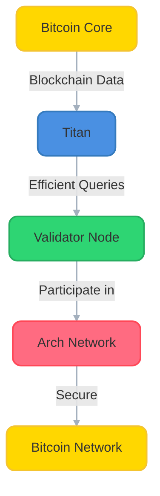
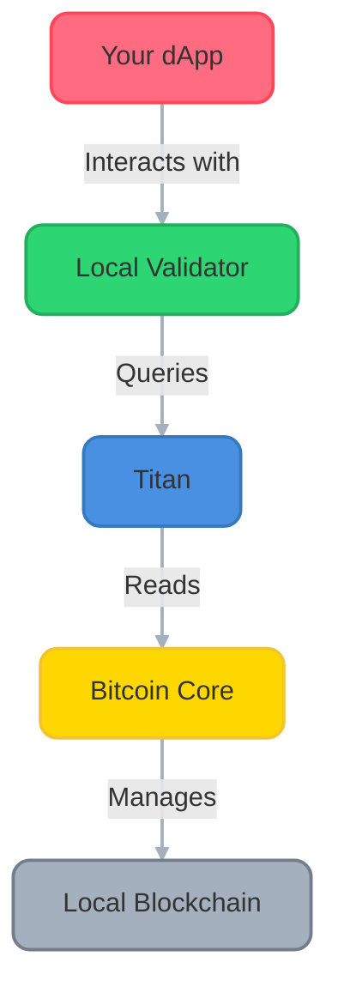

# 🏗️ Running an Arch Network Validator

> **Select Your Operating System**: This guide provides OS-specific instructions. Please note your OS (macOS or Linux) as you'll need to follow the appropriate instructions throughout this guide.

Welcome to the validator setup guide! This comprehensive guide will walk you through setting up a full Arch Network validator node, including all required components. As a validator, you'll be an integral part of the network's security and computation infrastructure.

## 🎯 What You'll Build



## 🎯 Component Architecture



## 💡 Understanding Your Role

As a validator, you will:
- Execute smart contracts and validate transactions
- Participate in network consensus
- Help secure the Bitcoin integration
- Earn rewards for your contribution

## 📋 System Requirements

Before starting, ensure you have:
- 4+ CPU cores
- 16GB+ RAM
- Disk Space Requirements:
  - Regtest mode: 100GB+ SSD storage
  - Testnet mode: 500GB+ SSD storage (as of 2024, grows over time)
  - Mainnet mode: 800GB+ SSD storage (as of 2024, grows over time)
- Stable internet connection (10+ Mbps recommended)
- Linux (Ubuntu 20.04+ or similar) or macOS (12.0+)

> **Note**: This guide uses regtest mode by default, which requires minimal disk space. If you plan to run on testnet or mainnet, ensure you have sufficient storage as blockchain data grows over time. The actual space needed may be larger than listed above depending on various factors like pruning settings and index options.

## 🗺️ Setup Overview

1. **Bitcoin Core Setup** (30-45 minutes)
   - Install dependencies
   - Build from source
   - Configure for your network

2. **Titan Setup** (15-20 minutes)
   - Build Titan from source
   - Configure for your network

3. **Validator Setup** (10-15 minutes)
   - Install Arch Network CLI
   - Configure validator node
   - Join the network

Total estimated time: 1-1.5 hours

## 📱 Terminal Multiplexer Setup

We'll use `tmux` to manage multiple processes (Bitcoin Core, Titan, and the validator) in separate panes. This allows you to monitor all components simultaneously.

**macOS Instructions:**
```bash
# Install tmux
brew install tmux
```

**Linux Instructions:**
```bash
# Install tmux
sudo apt-get update && sudo apt-get install -y tmux
```

### Using tmux

Basic tmux commands (press Ctrl+b first, then the command):
- `"` - split pane horizontally (creates a new pane below)
- `%` - split pane vertically (creates a new pane to the right)
- `↑` or `↓` - navigate between panes using arrow keys
- `d` - detach from session
- `x` - kill current pane

To start a new session:
```bash
# Create and attach to a new tmux session
TERM=xterm-256color tmux new -s arch-validator
```

To reattach to an existing session:
```bash
# List sessions
tmux ls

# Reattach to the session
tmux attach -t arch-validator
```

### 🎯 Step-by-Step Component Launch

1. **Start Bitcoin Core** (in first pane):
   ```bash
   bitcoind -regtest -daemon
   tail -f ~/.bitcoin/regtest/debug.log  # For Linux
   # OR
   tail -f ~/Library/Application\ Support/Bitcoin/regtest/debug.log  # For macOS
   ```

2. **Create and launch Titan** (in second pane):
   - Press `Ctrl+b`, then `"` to create a new pane below
   - You'll automatically be switched to the new pane
   ```bash
   cd ~/Titan
   cargo run --bin titan -- \
       --bitcoin-rpc-url http://127.0.0.1:18443 \
       --bitcoin-rpc-username bitcoin \
       --bitcoin-rpc-password bitcoinpass \
       --chain regtest \
       --index-addresses \
       --index-bitcoin-transactions \
       --enable-tcp-subscriptions \
       --data-dir ./data \
       --main-loop-interval 0
   ```

3. **Launch Validator** (in third pane):
   - Press `Ctrl+b`, then `↑` to go back to the top pane
   - Press `Ctrl+b`, then `"` to create a new pane between Bitcoin Core and Titan
   ```bash
   cd ~/arch-validator
   ./local_validator-darwin-amd64 \  # For macOS
   # OR
   ./local_validator-linux-amd64 \   # For Linux
       --rpc-bind-ip 127.0.0.1 \
       --rpc-bind-port 9002 \
       --titan-endpoint http://127.0.0.1:3030
   ```

> **Navigation Tips**: 
> - Use `Ctrl+b` then arrow keys to move between panes at any time
> - The active pane has a highlighted border
> - If you get lost, `Ctrl+b` then arrow keys will help you navigate back to where you need to be

## 1. 🏗️ Bitcoin Core Setup

### 1.1 Installing Dependencies

**macOS Instructions:**
```bash
# Install required dependencies via Homebrew
brew install automake boost ccache git libevent libnatpmp libtool \
    llvm miniupnpc pkg-config python qrencode qt@5 sqlite zeromq
```

**Linux (Ubuntu/Debian) Instructions:**
```bash
# Install required dependencies
sudo apt-get update && sudo apt-get install -y \
    automake autotools-dev bsdmainutils build-essential ccache \
    clang gcc git libboost-dev libboost-filesystem-dev \
    libboost-system-dev libboost-test-dev libevent-dev \
    libminiupnpc-dev libnatpmp-dev libsqlite3-dev libtool \
    libzmq3-dev pkg-config python3 qtbase5-dev qttools5-dev \
    qttools5-dev-tools qtwayland5 systemtap-sdt-dev
```

### 1.2 🏭 Building Bitcoin Core

```bash
# Clone Bitcoin Core
git clone https://github.com/bitcoin/bitcoin.git
cd bitcoin

# Switch to latest stable version
git checkout v28.0

# Prepare the build system
./autogen.sh

# Configure the build
./configure

# Build Bitcoin Core (this might take 30-45 minutes)
make -j$(nproc)  # Uses all available CPU cores

# Install the binaries
sudo make install
```

### 1.3 ⚙️ Bitcoin Core Configuration

Create your configuration directory:

**macOS:**
```bash
mkdir -p ~/Library/'Application Support'/Bitcoin
CONFIG_DIR=~/Library/'Application Support'/Bitcoin
```

**Linux:**
```bash
mkdir -p ~/.bitcoin
CONFIG_DIR=~/.bitcoin
```

Create and edit your configuration file:

```bash
cat > "$CONFIG_DIR/bitcoin.conf" << 'EOF'
# 🌐 Network Settings
server=1
regtest=1
txindex=1
prune=0

# 🔒 Security (Change these values in production!)
rpcuser=bitcoin
rpcpassword=bitcoinpass  

# 🔧 Performance
dbcache=150
maxmempool=100

# 🚀 Development Settings
fallbackfee=0.001
maxtxfee=0.002

[regtest]
rpcbind=0.0.0.0
rpcport=18443
wallet=testwallet
EOF
```

## 2. 🚀 Titan Setup

### 2.1 Installing Rust and Dependencies

**macOS Instructions:**
```bash
# Install Rust if you haven't already
curl --proto '=https' --tlsv1.2 -sSf https://sh.rustup.rs | sh

# Install additional dependencies
brew install pkg-config openssl
```

**Linux (Ubuntu/Debian) Instructions:**
```bash
# Install Rust if you haven't already
curl --proto '=https' --tlsv1.2 -sSf https://sh.rustup.rs | sh
sudo apt install cargo
rustup install nightly # For Titan
rustup default nightly

# Install additional dependencies
sudo apt-get update && sudo apt-get install -y \
    pkg-config libssl-dev build-essential
```

### 2.2 Building Titan

```bash
# Clone Titan repository
cd ~
git clone https://github.com/saturnbtc/Titan.git
cd Titan

# Build Titan (this might take 10-15 minutes)
cargo build --release -Znext-lockfile-bump
```

### 2.3 🚀 Launch Titan

Create a new tmux pane (Ctrl+b, then "):
```bash
# Start Titan
cd ~/Titan
cargo run --bin titan -- \
    --bitcoin-rpc-url http://127.0.0.1:18443 \
    --bitcoin-rpc-username bitcoin \
    --bitcoin-rpc-password bitcoinpass \
    --chain regtest \
    --index-addresses \
    --index-bitcoin-transactions \
    --enable-tcp-subscriptions \
    --data-dir ./data \
    --main-loop-interval 0
```

> Note: Make sure Bitcoin Core is running before starting Titan. The RPC username and password should match what you set in your `bitcoin.conf` file.

## 3. 🎯 Validator Setup

> **Note**: The validator binary is currently only available for Linux (x86_64/amd64) systems. ARM architectures (including Apple Silicon Macs) are not supported at this time.

### 3.1 Download the Validator Binary

**Linux (x86_64/amd64) Instructions:**
```bash
# Create a directory for the validator
mkdir -p ~/arch-validator && cd ~/arch-validator

# Download the latest validator binary
curl -LO "https://github.com/Arch-Network/arch-node/releases/latest/download/local_validator-linux-amd64"

# Make it executable and rename it for convenience
chmod +x local_validator-linux-amd64
mv local_validator-linux-amd64 local_validator
```

### 3.2 🚀 Launch the Validator

Create a new tmux pane (Ctrl+b, then "):
```bash
# Start the validator
cd ~/arch-validator
./local_validator \
    --rpc-bind-ip 127.0.0.1 \
    --rpc-bind-port 9002 \
    --titan-endpoint http://127.0.0.1:3030
```

Your tmux session should now have three panes:
1. Top: Bitcoin Core logs
2. Middle: Titan process
3. Bottom: Validator process

To detach from the session while keeping everything running, press Ctrl+b, then d. You can reattach later using `tmux attach -t arch-validator`.

## 🎉 Congratulations!

You now have a complete Arch Network validator node running! Your setup includes:
- Bitcoin Core in regtest mode
- Titan indexer for efficient Bitcoin data access
- Arch Network validator node

To verify everything is working:
1. Bitcoin Core should be accessible at `http://127.0.0.1:18443`
2. Titan should be accessible at `http://127.0.0.1:3030`
3. Your validator should be accessible at `http://127.0.0.1:9002`

## 🔍 Troubleshooting

If you encounter any issues:
1. Ensure all components are running in the correct order:
   - Bitcoin Core first
   - Titan second
   - Validator last
2. Check the logs of each component for any error messages
3. Verify your configuration settings match across all components
4. Ensure all required ports are available and not blocked by a firewall

For additional help, join our [Discord community](https://discord.gg/archnetwork) or visit our [GitHub repository](https://github.com/Arch-Network).