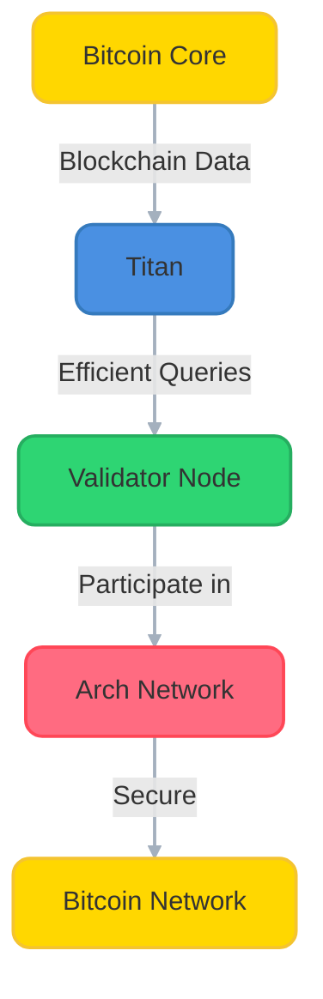
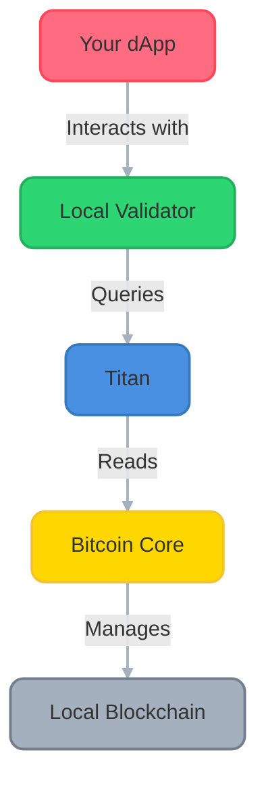

# 🏗️ Running an Arch Network Validator

Welcome to the validator setup guide! This comprehensive guide will walk you through setting up a full Arch Network validator node, including all required components. As a validator, you'll be an integral part of the network's security and computation infrastructure.

## 🎯 What You'll Build



## 💡 Understanding Your Role

As a validator, you will:
- Execute smart contracts and validate transactions
- Participate in network consensus
- Help secure the Bitcoin integration
- Earn rewards for your contribution

## 📋 System Requirements

Before starting, ensure you have:
- 4+ CPU cores
- 16GB+ RAM
- 100GB+ SSD storage
- Stable internet connection
- Linux (Ubuntu 20.04+ or similar) or macOS (12.0+)

## 🗺️ Setup Overview

1. **Bitcoin Core Setup** (30-45 minutes)
   - Install dependencies
   - Build from source
   - Configure for your network

2. **Titan Setup** (15-20 minutes)
   - Build our custom fork
   - Configure for your network

3. **Validator Setup** (10-15 minutes)
   - Install Arch Network CLI
   - Configure validator node
   - Join the network

Total estimated time: 1-1.5 hours

## 🎯 What We're Building



### 🧩 Understanding the Components

#### Bitcoin Core 🏦
- Your personal Bitcoin node
- Manages a local blockchain in regtest mode
- Perfect for development - create test Bitcoin at will!

#### Titan ⚡
- Lightning-fast Bitcoin data indexer
- Makes blockchain queries super efficient
- Essential for real-time dApp responses

## 📋 Progress Tracker
- [ ] Install Bitcoin Core dependencies
- [ ] Build Bitcoin Core
- [ ] Configure Bitcoin Core
- [ ] Test Bitcoin Core
- [ ] Build Titan
- [ ] Configure Titan
- [ ] Test the full stack

## 1. 🏗️ Bitcoin Core Setup

### 1.1 Installing Dependencies

<div class="platform-select">
<div class="platform-option">
<h4>macOS</h4>

```bash
# Install required dependencies via Homebrew
brew install automake boost ccache git libevent libnatpmp libtool \
    llvm miniupnpc pkg-config python qrencode qt@5 sqlite zeromq
```
</div>

<div class="platform-option">
<h4>Ubuntu/Debian Linux</h4>

```bash
# Install required dependencies
sudo apt-get update && sudo apt-get install -y \
    automake autotools-dev bsdmainutils build-essential ccache \
    clang gcc git libboost-dev libboost-filesystem-dev \
    libboost-system-dev libboost-test-dev libevent-dev \
    libminiupnpc-dev libnatpmp-dev libsqlite3-dev libtool \
    libzmq3-dev pkg-config python3 qtbase5-dev qttools5-dev \
    qttools5-dev-tools qtwayland5 systemtap-sdt-dev
```
</div>

<div class="platform-option">
<h4>RHEL/Fedora Linux</h4>

```bash
# Install required dependencies
sudo dnf install -y automake boost-devel ccache clang gcc git \
    libevent-devel libnatpmp-devel libtool make miniupnpc-devel \
    pkg-config python3 qt5-qtbase-devel qt5-qttools-devel \
    sqlite-devel systemtap-sdt-devel zeromq-devel
```
</div>
</div>

### 1.2 🏭 Building Bitcoin Core

```bash
# Clone Bitcoin Core
git clone https://github.com/bitcoin/bitcoin.git
cd bitcoin

# Switch to latest stable version
git checkout v28.0

# Prepare the build system
./autogen.sh

# Configure the build
./configure

# Build Bitcoin Core (this might take 30-45 minutes)
make -j$(nproc)  # Uses all available CPU cores

# Install the binaries
sudo make install
```

### 1.3 ⚙️ Bitcoin Core Configuration

Create your configuration directory:

<div class="platform-select">
<div class="platform-option">
<h4>macOS</h4>

```bash
mkdir -p ~/Library/'Application Support'/Bitcoin
CONFIG_DIR=~/Library/'Application Support'/Bitcoin
```
</div>

<div class="platform-option">
<h4>Linux</h4>

```bash
mkdir -p ~/.bitcoin
CONFIG_DIR=~/.bitcoin
```
</div>
</div>

Create and edit your configuration file:

```bash
cat > "$CONFIG_DIR/bitcoin.conf" << 'EOF'
# 🌐 Network Settings
server=1
regtest=1
txindex=1
prune=0

# 🔒 Security (Change these values in production!)
rpcuser=bitcoin
rpcpassword=bitcoinpass  

# 🔧 Performance
dbcache=150
maxmempool=100

# 🚀 Development Settings
fallbackfee=0.001
maxtxfee=0.002

[regtest]
rpcbind=0.0.0.0
rpcport=18443
wallet=testwallet
EOF
```

### 1.4 🚀 Launch Bitcoin Core

```bash
# Start Bitcoin Core in regtest mode
bitcoind -regtest -daemon

# Verify it's running
bitcoin-cli -regtest getblockchaininfo
```