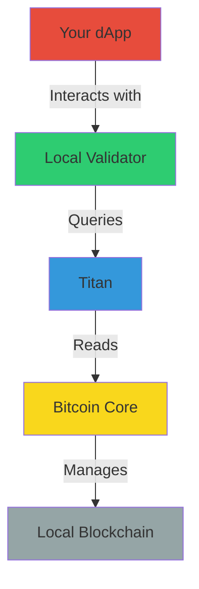

# 🔗 Setting up Bitcoin Core and Titan

Welcome to the detailed component setup guide! Here we'll walk through setting up Bitcoin Core and Titan, the foundational components for your Arch Network development environment.

## 🎯 What We're Building



### 🧩 Understanding the Components

#### Bitcoin Core 🏦
- Your personal Bitcoin node
- Manages a local blockchain in regtest mode
- Perfect for development - create test Bitcoin at will!

#### Titan ⚡
Titan is a powerful Bitcoin blockchain indexer that offers several advantages over traditional indexers like Electrs:

- **Advanced Inscription & Runes Support**: Titan is specifically optimized for indexing Bitcoin's latest protocols like Ordinals (inscriptions) and Runes, making it essential for developers working with these new Bitcoin capabilities.

- **Performance Optimized**: Titan offers lightning-fast access to blockchain data through efficient indexing algorithms with a RocksDB backend, providing superior query performance compared to traditional indexers.

- **Comprehensive API**: Exposes a rich set of endpoints for querying blockchain data, including specialized endpoints for inscription content retrieval and rune transactions tracking.

- **Real-time Subscriptions**: Features TCP subscription support with webhook capabilities, allowing your applications to receive real-time updates when new Bitcoin blocks or transactions are processed.

- **Modular Architecture**: Built with a well-structured modular design that separates concerns and allows for targeted optimization of different blockchain data types.

Arch Network has switched from Electrs to Titan to leverage these advanced capabilities, particularly for working with inscriptions and runes. As Bitcoin evolves with new protocols and standards like BRC-20 tokens and Runes, Titan provides the necessary tooling to efficiently index and query these new data structures, allowing developers to build more sophisticated applications on Bitcoin.

## 📋 Progress Tracker
- [ ] Install Bitcoin Core dependencies
- [ ] Build Bitcoin Core
- [ ] Configure Bitcoin Core
- [ ] Test Bitcoin Core
- [ ] Build Titan
- [ ] Configure Titan
- [ ] Test the full stack

## 1. 🏗️ Bitcoin Core Setup

### 1.1 Installing Dependencies

Choose your operating system:

#### 🍎 macOS
```bash
# Install required dependencies via Homebrew
brew install automake boost ccache git libevent libnatpmp libtool llvm miniupnpc pkg-config python qrencode qt@5 sqlite zeromq
```

#### 🐧 Ubuntu/Debian Linux
```bash
# Install required dependencies
sudo apt-get install automake autotools-dev bsdmainutils build-essential ccache clang gcc git libboost-dev libboost-filesystem-dev libboost-system-dev libboost-test-dev libevent-dev libminiupnpc-dev libnatpmp-dev libsqlite3-dev libtool libzmq3-dev pkg-config python3 qtbase5-dev qttools5-dev qttools5-dev-tools qtwayland5 systemtap-sdt-dev
```

> 💡 **What are these packages?** These are the building blocks needed to compile Bitcoin Core. Each one provides essential functionality, from cryptography to networking.

### 1.2 🏭 Building Bitcoin Core

Let's get the source code and build it:

```bash
# Clone Bitcoin Core
git clone https://github.com/bitcoin/bitcoin.git
cd bitcoin

# Switch to latest stable version
git checkout v28.0

# Prepare the build system
./autogen.sh

# Configure the build
./configure

# Build Bitcoin Core (this might take a while ☕)
make

# Install the binaries
sudo make install
```

> 🎯 **Progress Check!** Run `bitcoin-cli --version` to verify the installation.

### 1.3 ⚙️ Bitcoin Core Configuration

First, let's create our configuration directory:

```bash
# For macOS
mkdir -p ~/Library/'Application Support'/Bitcoin

# For Linux
mkdir -p ~/.bitcoin
```

Create your `bitcoin.conf` file:

```bash
# macOS
nano ~/Library/'Application Support'/Bitcoin/bitcoin.conf

# Linux
nano ~/.bitcoin/bitcoin.conf
```

Add this configuration:

```ini
# 🌐 Network Settings
server=1
regtest=1
txindex=1
prune=0

# 🔒 Security
rpcuser=bitcoin
# Change this in production!
rpcpassword=bitcoinpass  

# 🔧 Performance
dbcache=150
maxmempool=100

# 🚀 Development Settings
fallbackfee=0.001
maxtxfee=0.002

[regtest]
rpcbind=0.0.0.0
rpcport=18443
wallet=testwallet
```

> 🔐 **Security Note**: In a production environment, always use strong, unique passwords!

### 1.4 🚀 Launch Bitcoin Core

```bash
# Start Bitcoin Core in regtest mode
bitcoind -regtest -daemon
```

#### 🎮 Fun Experiment: Create Some Test Bitcoin!

```bash
# create wallet
bitcoin-cli -regtest createwallet "testwallet"

# Generate a new address
ADDR=$(bitcoin-cli -regtest getnewaddress)

# Mine 101 blocks (need 100 for coin maturity)
bitcoin-cli -regtest generatetoaddress 101 $ADDR

# Check your balance
bitcoin-cli -regtest getbalance
```

> 🎉 You should see 50 BTC! In regtest mode, each block rewards you with 50 BTC.

## 2. ⚡ Titan Setup

### 2.1 🔧 Building Titan

```bash
# Clone Titan
git clone https://github.com/SaturnBTC/Titan.git
cd Titan

# Build and install
cargo build --release
```

### 2.2 🚀 Running Titan

For local development:

```bash
./target/release/titan \
    --bitcoin-rpc-url http://127.0.0.1:18443 \
    --bitcoin-rpc-cookie "bitcoin:bitcoinpass" \
    --chain regtest \
    --index-addresses \
    --index-bitcoin-transactions \
    --enable-tcp-subscriptions \
    --data-dir ./data \
    --main-loop-interval 0
```

You should see output indicating that Titan is running and connected to your Bitcoin node.

## 🎯 Verification

Let's make sure everything is working:

```bash
# 1. Check Bitcoin Core
bitcoin-cli -regtest getblockchaininfo

# 2. Check Titan
curl http://localhost:3030/blocks/tip/height
```

## 3. 🌐 Testnet4 Configuration

Want to test your dApp in a more realistic environment? Let's set up testnet4!

### 3.1 Bitcoin Core for Testnet4

Update your `bitcoin.conf` to include testnet4 settings:

```ini
# Core Settings [Keep your existing settings]

# Testnet4 Configuration
[testnet4]
rpcbind=0.0.0.0           # Bind to all network interfaces
rpcport=18332             # RPC port for testnet
wallet=testwallet         # Default wallet name for testnet
```

### 3.2 Titan for Testnet4

For connecting to testnet4, use this configuration:

```bash
# Run Titan with testnet4 configuration
./target/release/titan \
    --bitcoin-rpc-url http://<BITCOIN_NODE_ENDPOINT>:<PORT> \
    --bitcoin-rpc-cookie "<BITCOIN_RPC_USER>:<BITCOIN_RPC_PASSWORD>" \
    --chain testnet \
    --index-addresses \
    --index-bitcoin-transactions \
    --enable-tcp-subscriptions \
    --data-dir ./data \
    --main-loop-interval 0
```

### 3.3 Local Validator with Testnet4

Configure the local validator for testnet4:

```bash
# Start the local validator with testnet4 configuration
cargo run -p local_validator -- \
    --network-mode devnet \
    --titan-endpoint http://127.0.0.1:3030 \
    --titan-socket-endpoint 127.0.0.1:8080
```

> 🔍 **Port Reference**:
> - Regtest/Testnet mode:
>   - Titan HTTP API: 3030
>   - Titan TCP Socket: 8080

### 3.4 Verify Testnet4 Setup

```bash
# Check Bitcoin Core testnet sync
bitcoin-cli -testnet getblockchaininfo

# Check Titan testnet connection
curl http://localhost:3030/blocks/tip/height
```

## 🚨 Troubleshooting

### Common Issues

#### 🔴 Bitcoin Core won't start
```bash
Error: Cannot obtain a lock on data directory
```
👉 Bitcoin Core is probably already running. Try:
```bash
bitcoin-cli stop
# Wait a few seconds and try again
```

#### 🔴 Titan connection failed
```bash
Error: Connection refused
```
👉 Make sure Bitcoin Core is running and check your bitcoin.conf settings.

#### 🔴 Testnet sync taking too long
```bash
"blocks": 1234567,
"headers": 2345678
```
👉 Initial testnet sync can take several hours. You can use regtest mode for development while waiting.

## 🎉 Next Steps

Congratulations! You now have a working Bitcoin development environment. Ready to:

1. [Launch the Local Validator](setting-up-a-project.md)
2. [Build Your First dApp](../guides/how-to-write-arch-program.md)
3. [Explore Example Projects](../guides/guides.md)

## 🆘 Need Help?

- Join our [Discord](https://discord.gg/archnetwork)
- Check the [Bitcoin Core docs](https://github.com/bitcoin/bitcoin/tree/master/doc)
- Browse the [Titan documentation](https://github.com/SaturnBTC/Titan)
