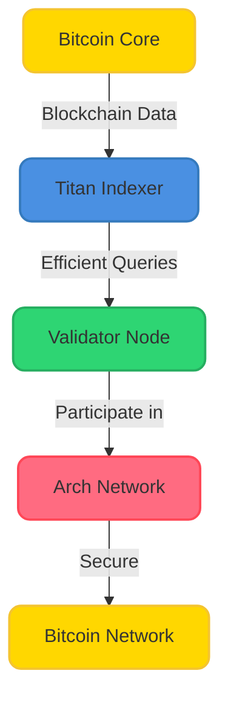
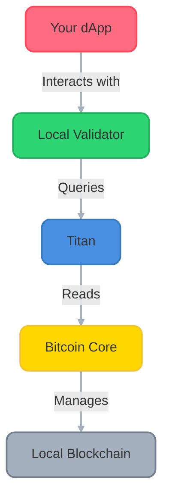

# 🏗️ Running an Arch Network Validator

Welcome to the validator setup guide! This guide will walk you through setting up a full Arch Network validator node. You can choose between an automated setup or manual configuration depending on your needs.

## 🎯 What You'll Build



## 🎯 Component Architecture



## 💡 Understanding Your Role

As a validator, you will:
- Execute smart contracts and validate transactions
- Participate in network consensus
- Help secure the Bitcoin integration
- Earn rewards for your contribution

## 📋 System Requirements

- **CPU**: 4+ cores recommended
- **RAM**: 16GB+ recommended  
- **Storage**: 100GB+ SSD for regtest, 500GB+ for testnet/mainnet
- **Network**: Stable internet connection (10+ Mbps)
- **OS**: Linux (Ubuntu 20.04+) or macOS (12.0+)

## 🚀 Setup Options

Choose your preferred setup method:

### Option A: Automated Setup (Recommended)

The easiest way to get started using the CLI orchestrate command.

**Prerequisites:**
- **Docker**: Required on all platforms - [Install Docker](https://docs.docker.com/engine/install/)
- **Docker Management** (optional but recommended):
  - **macOS**: [OrbStack](https://orbstack.dev/) (recommended) or [Docker Desktop](https://www.docker.com/products/docker-desktop/)
  - **Linux**: [Docker Desktop](https://www.docker.com/products/docker-desktop/) (optional GUI)
- **Arch Network CLI** - Download from [releases](https://github.com/Arch-Network/arch-node/releases/latest)

**Setup:**
```bash
# 1. Download and install the Arch CLI
# (Download the appropriate binary for your platform from the releases page)

# 2. Start the complete validator stack
cli orchestrate start
```

This automatically starts:
- Bitcoin Core (regtest mode)
- Titan indexer
- Local validator
- All necessary networking and configuration

**Service URLs:**
- Bitcoin Core RPC: `http://127.0.0.1:18443`
- Titan API: `http://127.0.0.1:3030`
- Validator RPC: `http://127.0.0.1:9002`

**Management Commands:**
```bash
# Check status
cli orchestrate status

# Stop all services
cli orchestrate stop

# View logs
cli orchestrate logs

# Clean up (removes all data)
cli orchestrate clean
```

### Option B: Manual Setup (Advanced)

For developers who want full control over their environment.

#### Step 1: Bitcoin Core Setup

**Install and Start Bitcoin Core:**
```bash
# Install Bitcoin Core (if not already installed)
# macOS: brew install bitcoin
# Linux: Download from https://bitcoin.org/en/download

# Start Bitcoin Core in regtest mode
bitcoind -regtest -port=18444 -rpcport=18443 \
    -rpcuser=bitcoin -rpcpassword=bitcoinpass \
    -fallbackfee=0.001

# First-time setup (only needed once)
# Create a wallet called "testwallet"
bitcoin-cli -regtest -rpcuser=bitcoin -rpcpassword=bitcoinpass createwallet testwallet

# Generate an address and mine the first 100 blocks to it
ADDRESS=$(bitcoin-cli -regtest -rpcuser=bitcoin -rpcpassword=bitcoinpass getnewaddress)
bitcoin-cli -regtest -rpcuser=bitcoin -rpcpassword=bitcoinpass generatetoaddress 100 $ADDRESS
```

#### Step 2: Titan Indexer Setup

**Clone and Build Titan:**
```bash
# Clone Titan repository
git clone https://github.com/saturnbtc/Titan.git
cd Titan

# Build Titan
cargo build --release
```

**Start Titan:**
```bash
# Start Titan indexer
cargo run --bin titan -- \
    --bitcoin-rpc-url http://127.0.0.1:18443 \
    --bitcoin-rpc-username bitcoin \
    --bitcoin-rpc-password bitcoinpass \
    --chain regtest \
    --index-addresses \
    --index-bitcoin-transactions \
    --enable-tcp-subscriptions \
    --main-loop-interval 0 \
    --http-listen 127.0.0.1:3030
```

#### Step 3: Validator Setup

**Start Validator:**
```bash
# Using the CLI (recommended)
cli validator start --network regtest --titan-endpoint http://127.0.0.1:3030

# OR using the binary directly
./local_validator \
    --rpc-bind-ip 127.0.0.1 \
    --rpc-bind-port 9002 \
    --titan-endpoint http://127.0.0.1:3030
```

## 🔄 Process Management

### For Automated Setup
The orchestrate command handles all process management automatically using Docker containers.

### For Manual Setup
You may want to use a process manager to keep services running:

**Using tmux (recommended):**
```bash
# Create a new tmux session
tmux new -s arch-validator

# Split into three panes
# Ctrl+b then " to split horizontally
# Ctrl+b then % to split vertically
# Use arrow keys to navigate between panes

# Start each service in a separate pane:
# Pane 1: bitcoind
# Pane 2: Titan
# Pane 3: Validator
```

**Using systemd (Linux):**
```bash
# Create service files for each component
sudo tee /etc/systemd/system/bitcoind.service > /dev/null <<EOF
[Unit]
Description=Bitcoin Core Daemon
After=network.target

[Service]
ExecStart=/usr/local/bin/bitcoind -regtest -port=18444 -rpcport=18443 -rpcuser=bitcoin -rpcpassword=bitcoinpass -fallbackfee=0.001
User=bitcoin
Restart=always

[Install]
WantedBy=multi-user.target
EOF

# Enable and start services
sudo systemctl enable bitcoind
sudo systemctl start bitcoind
```

## ✅ Verification

### Check Service Status

**Automated Setup:**
```bash
cli orchestrate status
```

**Manual Setup:**
```bash
# Check Bitcoin Core
bitcoin-cli -regtest -rpcuser=bitcoin -rpcpassword=bitcoinpass getblockchaininfo

# Check Titan
curl http://127.0.0.1:3030/health

# Check Validator
curl -X POST -H 'Content-Type: application/json' \
    -d '{"jsonrpc":"2.0","id":1,"method":"get_health"}' \
    http://127.0.0.1:9002
```

### Test Transaction Flow

```bash
# Deploy a simple program using the CLI
cli program deploy --program-path ./examples/hello-world --network regtest

# Send a transaction
cli transaction send --program-id <PROGRAM_ID> --network regtest
```

## 🔍 Troubleshooting

### Common Issues

**Docker/Orchestrate Issues:**
```bash
# Check Docker is running
docker ps

# Check orchestrate logs
cli orchestrate logs

# Reset everything
cli orchestrate stop
cli orchestrate clean
cli orchestrate start
```

**Manual Setup Issues:**
```bash
# Check if ports are in use
lsof -i :18443  # Bitcoin RPC
lsof -i :3030   # Titan API  
lsof -i :9002   # Validator RPC

# Check service logs
tail -f ~/.bitcoin/regtest/debug.log  # Bitcoin Core logs
```

**Connectivity Issues:**
- Ensure all services start in order: Bitcoin → Titan → Validator
- Verify Bitcoin Core is fully synced before starting Titan
- Check firewall settings aren't blocking required ports
- Confirm RPC credentials match across all services

## 🌐 Network Configurations

### Regtest (Development)
- **Purpose**: Local development and testing
- **Bitcoin Network**: Local regtest blockchain
- **Data**: Minimal, starts fresh each time
- **Use Case**: Development, testing, learning

### Testnet (Testing)
```bash
# For testnet, modify your configuration:
cli orchestrate start --network testnet
# OR manually configure with testnet parameters
```

### Mainnet (Production)
```bash
# For mainnet (when available):
cli orchestrate start --network mainnet
# Requires significant storage and bandwidth
```

## 📚 Next Steps

Once your validator is running:

1. **Deploy Your First Program**: Follow the [Quick Start Guide](./quick-start.md)
2. **Explore RPC Methods**: Check the [RPC API Reference](../rpc/http-methods.md)  
3. **Build Advanced Programs**: See [Program Development](../guides/understanding-arch-programs.md)
4. **Join the Community**: Connect on [Discord](https://discord.gg/archnetwork)

## 🎉 Congratulations!

You now have a complete Arch Network validator node running! You're ready to:
- Deploy and test smart contracts
- Participate in network consensus  
- Explore Bitcoin-native applications
- Build the future of Bitcoin programmability

For additional help, join our [Discord community](https://discord.gg/archnetwork) or visit our [GitHub repository](https://github.com/Arch-Network).