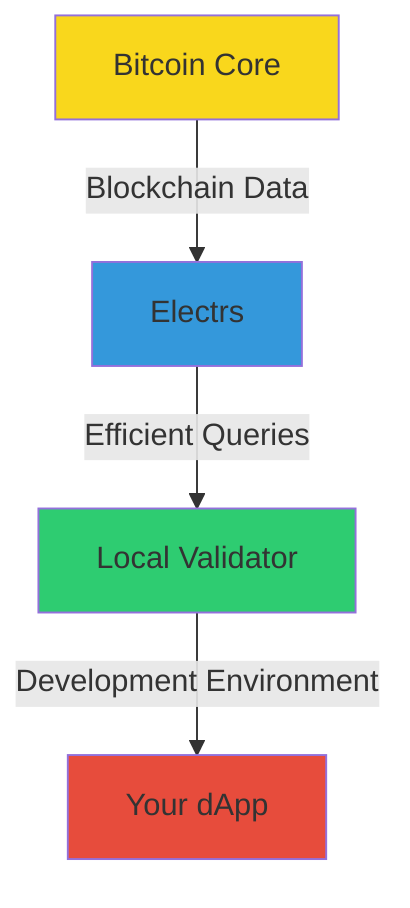

# 🚀 Quick Start Guide

Welcome to Arch Network! Let's get you up and running with a local development environment.

## 🎯 What You'll Build

In this guide, you'll set up a complete local development environment for building applications on Arch Network. You'll:

- 🏗️ Set up Bitcoin Core for local blockchain development
- ⚡ Configure Electrs for efficient blockchain queries
- 🔧 Launch the Arch Network local validator
- 🎮 Test your setup with some fun experiments!

## ⏱️ Time Estimate
- Total time: 45-60 minutes
- Active time: ~20 minutes
- Waiting time: ~30 minutes (during installations)

## 📋 Prerequisites
- Command line familiarity
- ~10GB free disk space
- macOS or Linux operating system
- Git installed
- Rust installed (we'll help you set this up!)

## 🏃‍♂️ Your Learning Path

1. [ ] Environment Setup (5 mins)
2. [ ] Bitcoin Core Installation (20 mins)
3. [ ] Electrs Setup (15 mins)
4. [ ] Local Validator Launch (10 mins)
5. [ ] First Experiments (5 mins)

## 🎓 Learning Track

We've designed this guide as an interactive learning experience. Each step will:
- Explain what we're building and why
- Show you exactly what to do
- Help you verify your progress
- Include fun experiments to test your setup

## 🎮 Ready to Start?

Choose your path:

1. [🔧 Full Environment Setup](environment-setup.md) - Recommended for most developers
2. [🚄 Quick Setup Script](dev-environment-setup.md) - For experienced developers
3. [📚 Detailed Component Guide](bitcoin-and-electrs-setup.md) - For those who want to understand every detail

> 💡 **Tip**: If this is your first time building on Arch Network, we recommend following the Full Environment Setup path. It includes detailed explanations that will help you understand the architecture better.

## 🆘 Need Help?

- Join our [Discord](https://discord.gg/archnetwork) for real-time support
- Check our [Troubleshooting Guide](troubleshooting.md)
- Browse our [FAQ](faq.md)

Let's begin your journey into cross-chain development! 🚀 