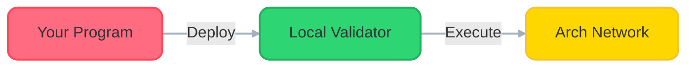

# 🚀 Quick Start Guide

Welcome to Arch Network! Let's get your first program running in under 15 minutes.

## 🎯 What You'll Build



## ⏱️ Time Estimate
- Total time: ~15 minutes
- Active time: ~10 minutes
- Waiting time: ~5 minutes (during installations)

## 📋 Quick Setup

### 1. Install CLI (2 minutes)

Download the appropriate binary for your system from the [latest releases page](https://github.com/Arch-Network/arch-node/releases/latest):

<div class="network-mode-container">
<div class="network-mode-header">
    <h4 id="arch-mode-title">macOS - Apple Silicon (M1/M2/M3)</h4>
</div>

<div class="network-mode-content">
<div id="mac-arm-command">

```bash
curl -L -o cli https://github.com/Arch-Network/arch-node/releases/latest/download/cli-aarch64-apple-darwin
chmod +x cli
sudo mv cli /usr/local/bin/
```

</div>
<div id="mac-intel-command" style="display: none;">

```bash
curl -L -o cli https://github.com/Arch-Network/arch-node/releases/latest/download/cli-x86_64-apple-darwin
chmod +x cli
sudo mv cli /usr/local/bin/
```

</div>
<div id="linux-x64-command" style="display: none;">

```bash
curl -L -o cli https://github.com/Arch-Network/arch-node/releases/latest/download/cli-x86_64-unknown-linux-gnu
chmod +x cli
sudo mv cli /usr/local/bin/
```

</div>
<div id="linux-arm-command" style="display: none;">

```bash
curl -L -o cli https://github.com/Arch-Network/arch-node/releases/latest/download/cli-aarch64-unknown-linux-gnu
chmod +x cli
sudo mv cli /usr/local/bin/
```

</div>
</div>

<div class="network-mode-buttons">
    <button class="network-mode-button active" onclick="switchArch('mac-arm')">macOS ARM</button>
    <button class="network-mode-button" onclick="switchArch('mac-intel')">macOS Intel</button>
    <button class="network-mode-button" onclick="switchArch('linux-x64')">Linux x64</button>
    <button class="network-mode-button" onclick="switchArch('linux-arm')">Linux ARM</button>
</div>
</div>

<script>
function switchArch(arch) {
    // Update buttons
    document.querySelectorAll('.network-mode-button').forEach(btn => {
        btn.classList.remove('active');
        if (
            (arch === 'mac-arm' && btn.textContent.includes('macOS ARM')) ||
            (arch === 'mac-intel' && btn.textContent.includes('macOS Intel')) ||
            (arch === 'linux-x64' && btn.textContent.includes('Linux x64')) ||
            (arch === 'linux-arm' && btn.textContent.includes('Linux ARM'))
        ) {
            btn.classList.add('active');
        }
    });

    // Update title
    const title = document.getElementById('arch-mode-title');
    switch (arch) {
        case 'mac-arm':
            title.textContent = 'macOS - Apple Silicon (M1/M2/M3)';
            break;
        case 'mac-intel':
            title.textContent = 'macOS - Intel';
            break;
        case 'linux-x64':
            title.textContent = 'Linux - x86_64';
            break;
        case 'linux-arm':
            title.textContent = 'Linux - ARM64';
            break;
    }

    // Show/hide appropriate command
    document.getElementById('mac-arm-command').style.display = arch === 'mac-arm' ? 'block' : 'none';
    document.getElementById('mac-intel-command').style.display = arch === 'mac-intel' ? 'block' : 'none';
    document.getElementById('linux-x64-command').style.display = arch === 'linux-x64' ? 'block' : 'none';
    document.getElementById('linux-arm-command').style.display = arch === 'linux-arm' ? 'block' : 'none';
}
</script>

After installation, verify it works:
```bash
cli --version
```

### 2. Start Local Validator (1 minute)

Start the local validator:

<div class="network-mode-container">
<div class="network-mode-header">
    <h4 id="network-mode-title">Development Network (Default)</h4>
</div>

<div class="network-mode-content">
<div id="dev-network-command">

```bash
# Start a local validator
cli validator start \
    --network-mode devnet \
    --rpc-bind-port 9002 \
    --titan-rpc-endpoint titan-node.dev.aws.archnetwork.xyz \
    --titan-rpc-port 18443 \
    --titan-rpc-username bitcoin \
    --titan-rpc-password 428bae8f3c94f8c39c50757fc89c39bc7e6ebc70ebf8f618
```

</div>
<div id="test-network-command" style="display: none;">

```bash
# Start a local validator
cli validator start \
    --network-mode testnet \
    --rpc-bind-port 9002 \
    --titan-rpc-endpoint titan-node.test.aws.archnetwork.xyz \
    --titan-rpc-port 49332 \
    --titan-rpc-username bitcoin \
    --titan-rpc-password 428bae8f3c94f8c39c50757fc89c39bc7e6ebc70ebf8f618
```

</div>
</div>

<div class="network-mode-buttons">
    <button class="network-mode-button active" onclick="switchNetwork('dev')">Development Network</button>
    <button class="network-mode-button" onclick="switchNetwork('test')">Test Network</button>
</div>
</div>

<style>
.network-mode-container {
    background: #f8f9fa;
    border: 1px solid #dee2e6;
    border-radius: 8px;
    padding: 1rem;
    margin: 1rem 0;
}

.network-mode-header h4 {
    margin: 0;
    padding: 0.5rem 0;
    color: #ff4757;
}

.network-mode-buttons {
    display: flex;
    gap: 0.5rem;
    margin-top: 1rem;
}

.network-mode-button {
    padding: 0.5rem 1rem;
    border: 1px solid #dee2e6;
    border-radius: 4px;
    background: #fff;
    cursor: pointer;
    font-size: 0.9rem;
}

.network-mode-button.active {
    background: #007bff;
    color: white;
    border-color: #0056b3;
}

.network-mode-button:hover:not(.active) {
    background: #f1f3f5;
}
</style>

<script>
function switchNetwork(mode) {
    // Update buttons
    document.querySelectorAll('.network-mode-button').forEach(btn => {
        btn.classList.remove('active');
        if ((mode === 'dev' && btn.textContent.includes('Development')) ||
            (mode === 'test' && btn.textContent.includes('Test'))) {
            btn.classList.add('active');
        }
    });

    // Update title
    const title = document.getElementById('network-mode-title');
    title.textContent = mode === 'dev' ? 'Development Network (Default)' : 'Test Network';

    // Show/hide appropriate command
    document.getElementById('dev-network-command').style.display = mode === 'dev' ? 'block' : 'none';
    document.getElementById('test-network-command').style.display = mode === 'test' ? 'block' : 'none';
}
</script>

### 3. Clone Example Project (2 minutes)
```bash
# Get the starter example
git clone https://github.com/Arch-Network/arch-examples
cd arch-examples/examples/helloworld
```

### 4. Build and Deploy (5 minutes)

<div class="platform-select">
<div class="platform-option">
<h4>First Time Setup</h4>

If this is your first time building Arch programs, install the required dependencies:

<details>
<summary>macOS Dependencies</summary>

```bash
# Install Rust if not already installed
curl --proto '=https' --tlsv1.2 -sSf https://sh.rustup.rs | sh
# Install Solana CLI tools
sh -c "$(curl -sSfL https://release.solana.com/v1.18.18/install)"
```
</details>

<details>
<summary>Linux Dependencies</summary>

```bash
# Install Rust if not already installed
curl --proto '=https' --tlsv1.2 -sSf https://sh.rustup.rs | sh
# Install build essentials
sudo apt-get update && sudo apt-get install -y build-essential
# Install Solana CLI tools
sh -c "$(curl -sSfL https://release.solana.com/v1.18.18/install)"
```
</details>
</div>
</div>

Build and deploy the program:
```bash
# Build the program
cargo build-sbf

# Deploy to your local validator
cli deploy ./target/deploy/helloworld.so
```

## 🎮 Test Your Deployment

Once deployed, you can interact with your program:
```bash
# Show program information
cli show <PROGRAM_ADDRESS>

# Get block information
cli get-block <BLOCK_HASH>
```

## 🌐 Ready for Testnet?

When you're ready to deploy to testnet:
```bash
cli validator start --network-mode testnet
cli deploy ./target/deploy/helloworld.so --network-mode testnet
```

## 📚 Next Steps

- [Modify the Hello World program](../guides/how-to-write-arch-program.md)
- [Create a fungible token](../guides/how-to-create-a-fungible-token.md)
- [Build a Runes swap application](../guides/how-to-build-runes-swap.md)
- [Set up a full validator node](bitcoin-and-titan-setup.md)

## 🆘 Need Help?

- Join our [Discord](https://discord.gg/archnetwork) for real-time support
- Check the [Troubleshooting Guide](troubleshooting.md)
- Browse the [FAQ](faq.md)