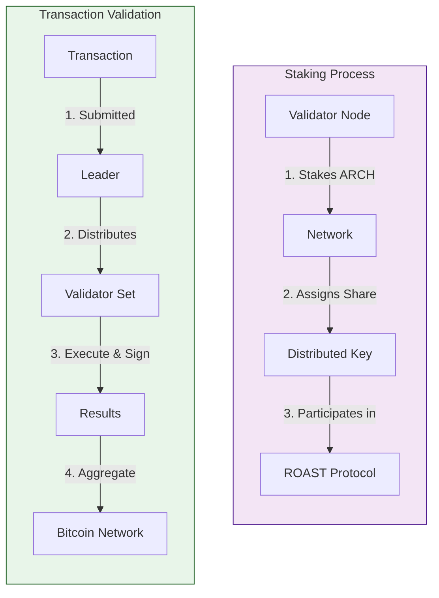
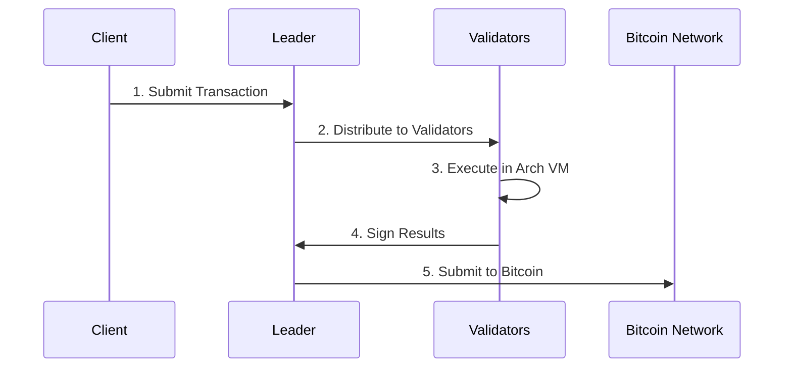
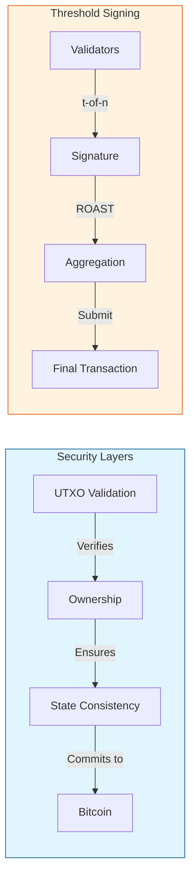

# Running Your Node

> ⚠️ **Mainnet Status**: Arch Network mainnet has not launched yet. This guide currently covers testnet operations. ARCH token staking and mainnet validator operations will be available when mainnet launches. More details coming soon.
> 
> 🔒 **Validator Pool Status**: The staking validator pool is currently closed membership. When mainnet launches, the validator pool will initially be limited to approved participants and will be opened to the public at some point in the future.

This guide will walk you through the process of operating an Arch Network validator node on testnet, including future staking mechanisms and network participation. When mainnet launches, validator operators will be an integral part of the network's security and computation infrastructure.

<div class="toc">
<h2>Contents</h2>

<div class="toc-list">
<a href="#prerequisites" class="toc-item">
    <div class="toc-left">
        <span class="toc-number">01</span>
        <span class="toc-text">Prerequisites</span>
    </div>
    <div class="toc-right">→</div>
</a>

<a href="#validator-responsibilities" class="toc-item">
    <div class="toc-left">
        <span class="toc-number">02</span>
        <span class="toc-text">Validator Responsibilities</span>
    </div>
    <div class="toc-right">→</div>
</a>

<a href="#setup-and-configuration" class="toc-item">
    <div class="toc-left">
        <span class="toc-number">03</span>
        <span class="toc-text">Setup & Configuration</span>
    </div>
    <div class="toc-right">→</div>
</a>

<a href="#monitoring-and-maintenance" class="toc-item">
    <div class="toc-left">
        <span class="toc-number">04</span>
        <span class="toc-text">Monitoring & Maintenance</span>
    </div>
    <div class="toc-right">→</div>
</a>
</div>
</div>

## Prerequisites

<div class="requirement-grid">
<div class="requirement-card">
<h3>🖥️ System Requirements</h3>
<table>
<tr><th>Component</th><th>Minimum</th><th>Recommended</th></tr>
<tr><td>CPU</td><td>4+ cores</td><td>8+ cores</td></tr>
<tr><td>RAM</td><td>16GB</td><td>32GB</td></tr>
<tr><td>Storage</td><td>100GB SSD</td><td>500GB+ SSD</td></tr>
<tr><td>Network</td><td>100Mbps</td><td>1Gbps+</td></tr>
<tr><td>OS</td><td>Ubuntu 20.04+ / macOS 12.0+</td><td>Latest LTS</td></tr>
</table>
</div>

<div class="requirement-card">
<h3>🔑 ARCH Tokens (Future Mainnet)</h3>
<p><strong>⚠️ Not yet available:</strong> ARCH token staking will be available for approved validators when mainnet launches. The staking validator pool is currently closed membership.</p>
<ul>
<li>Minimum stake amounts (TBD)</li>
<li>Lockup periods (TBD)</li>
<li>Commission rates (TBD)</li>
<li>Application process for validator pool membership (TBD)</li>
</ul>
<p><strong>Current Testnet:</strong> No ARCH tokens required - use the faucet for test tokens.</p>
<p>More details about mainnet staking and validator pool access will be announced closer to mainnet launch.</p>
</div>
</div>

## Validator Responsibilities

<div class="responsibility-grid">
<div class="responsibility-card">
<h3>🔄 Transaction Processing</h3>
<ul>
<li>Execute programs in Arch VM</li>
<li>Validate transaction signatures</li>
<li>Process Bitcoin-related transactions</li>
<li>Maintain transaction history</li>
</ul>
</div>

<div class="responsibility-card">
<h3>🤝 Consensus Participation</h3>
<ul>
<li>Participate in ROAST protocol</li>
<li>Contribute to threshold signing</li>
<li>Coordinate transaction finality</li>
<li>Verify state transitions</li>
</ul>
</div>

<div class="responsibility-card">
<h3>📊 State Management</h3>
<ul>
<li>Track UTXO states</li>
<li>Validate Bitcoin operations</li>
<li>Maintain state consistency</li>
<li>Verify network state</li>
</ul>
</div>
</div>

## Setup & Configuration

### 1. Install Arch Network CLI

<div class="platform-select">
<div class="platform-option">
<h4>macOS - Apple Silicon</h4>

```bash
curl -L -o cli https://github.com/Arch-Network/arch-node/releases/latest/download/cli-aarch64-apple-darwin
chmod +x cli
sudo mv cli /usr/local/bin/
```
</div>

<div class="platform-option">
<h4>macOS - Intel</h4>

```bash
curl -L -o cli https://github.com/Arch-Network/arch-node/releases/latest/download/cli-x86_64-apple-darwin
chmod +x cli
sudo mv cli /usr/local/bin/
```
</div>

<div class="platform-option">
<h4>Linux - x86_64</h4>

```bash
curl -L -o cli https://github.com/Arch-Network/arch-node/releases/latest/download/cli-x86_64-unknown-linux-gnu
chmod +x cli
sudo mv cli /usr/local/bin/
```
</div>

<div class="platform-option">
<h4>Linux - ARM64</h4>

```bash
curl -L -o cli https://github.com/Arch-Network/arch-node/releases/latest/download/cli-aarch64-unknown-linux-gnu
chmod +x cli
sudo mv cli /usr/local/bin/
```
</div>
</div>

Verify installation:
```bash
cli --version
```

### 2. Configure Bitcoin Node Access

<div class="network-select">
<div class="network-option">
<h4>📡 Remote Node (Recommended)</h4>

**Regtest/Development:**
```bash
--bitcoin-rpc-endpoint bitcoin-node.dev.aws.archnetwork.xyz \
--bitcoin-rpc-port 18443 \
--bitcoin-rpc-username bitcoin \
--bitcoin-rpc-password your_password \
--bitcoin-rpc-wallet testwallet
```

**Testnet:**
```bash
--bitcoin-rpc-endpoint bitcoin-node.test.aws.archnetwork.xyz \
--bitcoin-rpc-port 49332 \
--bitcoin-rpc-username bitcoin \
--bitcoin-rpc-password your_password \
--bitcoin-rpc-wallet testwallet
```
</div>

<div class="network-option">
<h4>🖥️ Local Node</h4>

For advanced users who want full control. See our [Bitcoin Node Setup Guide](bitcoin-and-titan-setup.md).

**Local Regtest Configuration:**
```bash
--bitcoin-rpc-endpoint 127.0.0.1 \
--bitcoin-rpc-port 18443 \
--bitcoin-rpc-username your_username \
--bitcoin-rpc-password your_password \
--bitcoin-rpc-wallet regtest
```

**Local Testnet Configuration:**
```bash
--bitcoin-rpc-endpoint 127.0.0.1 \
--bitcoin-rpc-port 18332 \
--bitcoin-rpc-username your_username \
--bitcoin-rpc-password your_password \
--bitcoin-rpc-wallet testnet
```

**Local Mainnet Configuration:**
```bash
--bitcoin-rpc-endpoint 127.0.0.1 \
--bitcoin-rpc-port 8332 \
--bitcoin-rpc-username your_username \
--bitcoin-rpc-password your_password \
--bitcoin-rpc-wallet mainnet
```
</div>
</div>

### 3. Start Your Validator

> ⚠️ **Current Status**: Mainnet is not yet available. Use testnet for current operations.

**For Testnet (Currently Available):**
```bash
cli validator-start \
  --network-mode testnet \
  --titan-endpoint titan-node.test.aws.archnetwork.xyz \
  --titan-socket-endpoint titan-node.test.aws.archnetwork.xyz:49332
```

**For Mainnet (Future):**
```bash
# Mainnet configuration will be available when mainnet launches
cli validator-start \
  --network-mode mainnet \
  --titan-endpoint <mainnet-endpoint-tbd> \
  --titan-socket-endpoint <mainnet-socket-tbd>
```

## Monitoring & Maintenance

<div class="monitoring-grid">
<div class="monitoring-card">
<h3>📊 Health Checks</h3>

```bash
# Node status
cli validator status

# Performance metrics
cli validator metrics
```
</div>

<div class="monitoring-card">
<h3>🔄 Sync Management</h3>

```bash
# Check sync status
cli validator sync-status

# Force resync if needed
cli validator resync
```
</div>
</div>

## Understanding Staking in Arch Network (Future)

> ⚠️ **Note**: The staking mechanisms described below are planned for mainnet launch and are not currently available. Current testnet operations do not require ARCH token staking.

<div class="staking-explanation">
<h3>🔐 What will Staking be?</h3>

Staking in Arch Network will be fundamentally different from traditional Proof of Stake systems. Instead of using staking for consensus, Arch Network will use staked validators to participate in the ROAST protocol for secure Bitcoin transaction signing.



<h3>🤔 Solana vs. Arch Network: Validator Comparison</h3>

<div class="comparison-table">
<table>
<tr><th>Feature</th><th>Solana</th><th>Arch Network</th></tr>
<tr>
  <td><b>Consensus Role</b></td>
  <td>Validators vote on blocks and produce blocks when selected as leader</td>
  <td>Validators execute transactions and sign Bitcoin transactions using threshold signatures</td>
</tr>
<tr>
  <td><b>Economic Model</b></td>
  <td>Block rewards + transaction fees</td>
  <td>Transaction fees + commission from Bitcoin operations</td>
</tr>
<tr>
  <td><b>Selection Mechanism</b></td>
  <td>Stake-weighted leader selection</td>
  <td>Stake-weighted participation in threshold signing committee</td>
</tr>
<tr>
  <td><b>Performance Metrics</b></td>
  <td>Vote signing speed, block production, uptime</td>
  <td>Transaction execution correctness, signing participation, uptime</td>
</tr>
<tr>
  <td><b>Slashing Conditions</b></td>
  <td>Double signing, unavailability</td>
  <td>Malicious signing, transaction manipulation attempts</td>
</tr>
<tr>
  <td><b>Hardware Requirements</b></td>
  <td>High-end CPU, 128GB+ RAM, 2TB+ NVMe</td>
  <td>4+ CPU cores, 16GB+ RAM, 100GB+ SSD</td>
</tr>
</table>
</div>

<h3>🚀 From Solana to Arch: Operational Transition Guide</h3>

If you're an experienced Solana validator operator, here's what you need to know about running an Arch Network validator:

<div class="transition-grid">
<div class="transition-card">
<h4>⚙️ Technical Setup</h4>
<ul>
<li><b>Lower Hardware Requirements:</b> Arch Network requires less powerful hardware than Solana</li>
<li><b>Bitcoin RPC Access:</b> Validators need Bitcoin node access (remote or local)</li>
<li><b>Key Management:</b> Different key structure focusing on distributed key generation</li>
<li><b>Monitoring:</b> Focus on signing participation rather than block production</li>
</ul>
</div>

<div class="transition-card">
<h4>💰 Economic Considerations</h4>
<ul>
<li><b>Staking Return Model:</b> Fee-based with transaction execution rewards</li>
<li><b>Reward Distribution:</b> Based on stake proportion and signing participation</li>
<li><b>Commission Structure:</b> Set during validator configuration</li>
<li><b>Lockup Periods:</b> Network-defined based on security requirements</li>
</ul>
</div>

<div class="transition-card">
<h4>🔄 Operational Differences</h4>
<ul>
<li><b>Signing vs. Voting:</b> Focus on correct transaction execution and signing</li>
<li><b>Performance Metrics:</b> Measured by signing participation and availability</li>
<li><b>Updates:</b> Less frequent than Solana's rapid release cycle</li>
<li><b>Network Bandwidth:</b> Lower requirements due to different architecture</li>
</ul>
</div>

<div class="transition-card">
<h4>🛣️ Onboarding Process (Future Mainnet)</h4>
<ul>
<li><b>Application:</b> Apply for validator pool membership (initially closed membership)</li>
<li><b>Approval:</b> Await approval for validator participation</li>
<li><b>Registration:</b> Complete validator registration through the network portal (TBD)</li>
<li><b>Stake Deposit:</b> Transfer ARCH tokens to the validator staking contract (TBD)</li>
<li><b>Configuration:</b> Set up your validator with proper Bitcoin node access</li>
<li><b>Key Generation:</b> Participate in distributed key generation ceremony</li>
<li><b>Activation:</b> Begin participation after stake activation period</li>
</ul>
<p><strong>Note:</strong> The validator pool will initially be limited to approved participants and will open to the public in the future.</p>

<h4>🧪 Current Testnet Onboarding</h4>
<ul>
<li><b>No Registration Required:</b> Simply start a testnet validator</li>
<li><b>No Stake Required:</b> Testnet operation is free</li>
<li><b>Configuration:</b> Set up your validator with testnet endpoints</li>
<li><b>Testing:</b> Deploy programs and test functionality</li>
<li><b>Immediate Participation:</b> Begin testing immediately</li>
</ul>
</div>
</div>

<h3>📊 Staking Economics (Future Mainnet)</h3>

<div class="economics-grid">
<div class="economics-card">
<h4>Validator Requirements (Planned)</h4>
<ul>
<li><b>Minimum Stake:</b> TBD - Details will be announced before mainnet launch</li>
<li><b>Lockup Period:</b> Network-defined based on security requirements (TBD)</li>
<li><b>Uptime Requirement:</b> High availability expected for signing participation</li>
<li><b>Performance Bonding:</b> Stake will act as bond for correct behavior</li>
</ul>
</div>

<div class="economics-card">
<h4>Reward Structure (Planned)</h4>
<ul>
<li><b>Base Rewards:</b> From transaction fees distributed proportionally to stake</li>
<li><b>Signing Rewards:</b> Additional rewards for participating in threshold signing</li>
<li><b>Commission:</b> Set percentage of rewards retained by validator</li>
<li><b>Distribution Frequency:</b> Continuous as transactions are processed</li>
</ul>
</div>
</div>

<div class="economics-card">
<h4>Current Testnet Operations</h4>
<ul>
<li><b>Open Access:</b> Anyone can run a testnet validator</li>
<li><b>No Staking Required:</b> Testnet validators operate without ARCH token requirements</li>
<li><b>Test Tokens:</b> Use the faucet to get test tokens for transactions</li>
<li><b>No Rewards:</b> Testnet operation is for testing and development only</li>
<li><b>Free Operation:</b> No costs beyond infrastructure for testnet participation</li>
</ul>
</div>

<div class="economics-card">
<h4>Validator Types Comparison</h4>
<table>
<tr><th>Validator Type</th><th>Access</th><th>Staking</th><th>Rewards</th></tr>
<tr>
  <td><b>Testnet Validators</b></td>
  <td>Open to all</td>
  <td>No staking required</td>
  <td>No rewards (testing only)</td>
</tr>
<tr>
  <td><b>Mainnet Staking Validators</b></td>
  <td>Closed membership initially</td>
  <td>ARCH tokens required (TBD)</td>
  <td>Transaction fees + signing rewards</td>
</tr>
</table>
</div>

<h3>🔄 ROAST Protocol Integration</h3>

The ROAST (Robust Asynchronous Schnorr Threshold) protocol enables validators to collectively sign Bitcoin transactions:



<h3>🛡️ Security Model</h3>



<div class="staking-card">
<h4>Key Features</h4>
<ul>
<li>Distributed key generation for secure signing</li>
<li>Threshold signature scheme (t-of-n) for fault tolerance</li>
<li>Bitcoin-based finality guarantees</li>
<li>Automatic malicious node detection</li>
</ul>
</div>
</div>

<style>
.requirement-grid, .responsibility-grid, .monitoring-grid {
    display: grid;
    grid-template-columns: repeat(auto-fit, minmax(300px, 1fr));
    gap: 1.5rem;
    margin: 2rem 0;
}

.requirement-card, .responsibility-card, .monitoring-card {
    background: #f8f9fa;
    border-radius: 8px;
    padding: 1.5rem;
    box-shadow: 0 2px 4px rgba(0,0,0,0.1);
}

.requirement-card h3, .responsibility-card h3, .monitoring-card h3 {
    margin-top: 0;
    color: #2c3e50;
}

.platform-select, .network-select {
    display: grid;
    grid-template-columns: repeat(auto-fit, minmax(300px, 1fr));
    gap: 1rem;
    margin: 1.5rem 0;
}

.platform-option, .network-option {
    background: #f8f9fa;
    border-radius: 8px;
    padding: 1.5rem;
    box-shadow: 0 2px 4px rgba(0,0,0,0.1);
}

table {
    width: 100%;
    border-collapse: collapse;
}

th, td {
    padding: 0.5rem;
    text-align: left;
    border-bottom: 1px solid #ddd;
}

th {
    background: #f1f3f5;
}

.staking-explanation {
    background: #ffffff;
    border-radius: 8px;
    padding: 2rem;
    margin: 2rem 0;
    box-shadow: 0 2px 4px rgba(0,0,0,0.1);
}

.staking-explanation h3 {
    color: #2c3e50;
    margin-top: 2rem;
}

.staking-explanation h3:first-child {
    margin-top: 0;
}

.staking-card {
    background: #f8f9fa;
    border-radius: 8px;
    padding: 1.5rem;
    margin-top: 2rem;
    box-shadow: 0 2px 4px rgba(0,0,0,0.1);
}

.staking-card h4 {
    margin-top: 0;
    color: #2c3e50;
}

.comparison-table {
    overflow-x: auto;
    margin: 1.5rem 0;
}

.comparison-table table {
    width: 100%;
    border-collapse: collapse;
}

.comparison-table th {
    background: #f1f3f5;
    padding: 0.75rem;
    text-align: left;
}

.comparison-table td {
    padding: 0.75rem;
    border-bottom: 1px solid #ddd;
}

.transition-grid, .economics-grid {
    display: grid;
    grid-template-columns: repeat(auto-fit, minmax(300px, 1fr));
    gap: 1.5rem;
    margin: 1.5rem 0;
}

.transition-card, .economics-card {
    background: #f8f9fa;
    border-radius: 8px;
    padding: 1.5rem;
    box-shadow: 0 2px 4px rgba(0,0,0,0.1);
}

.transition-card h4, .economics-card h4 {
    margin-top: 0;
    color: #2c3e50;
}
</style> 