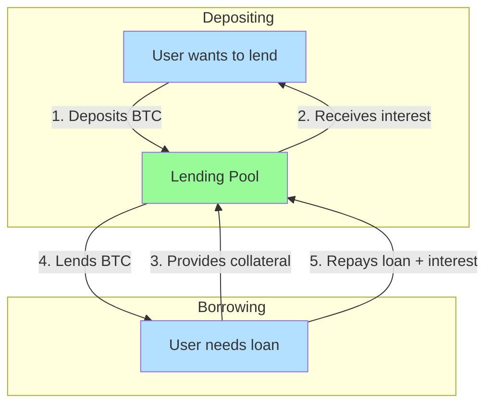
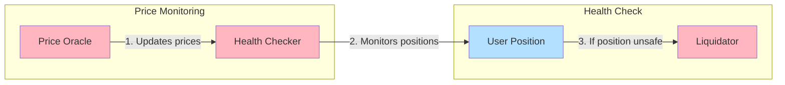
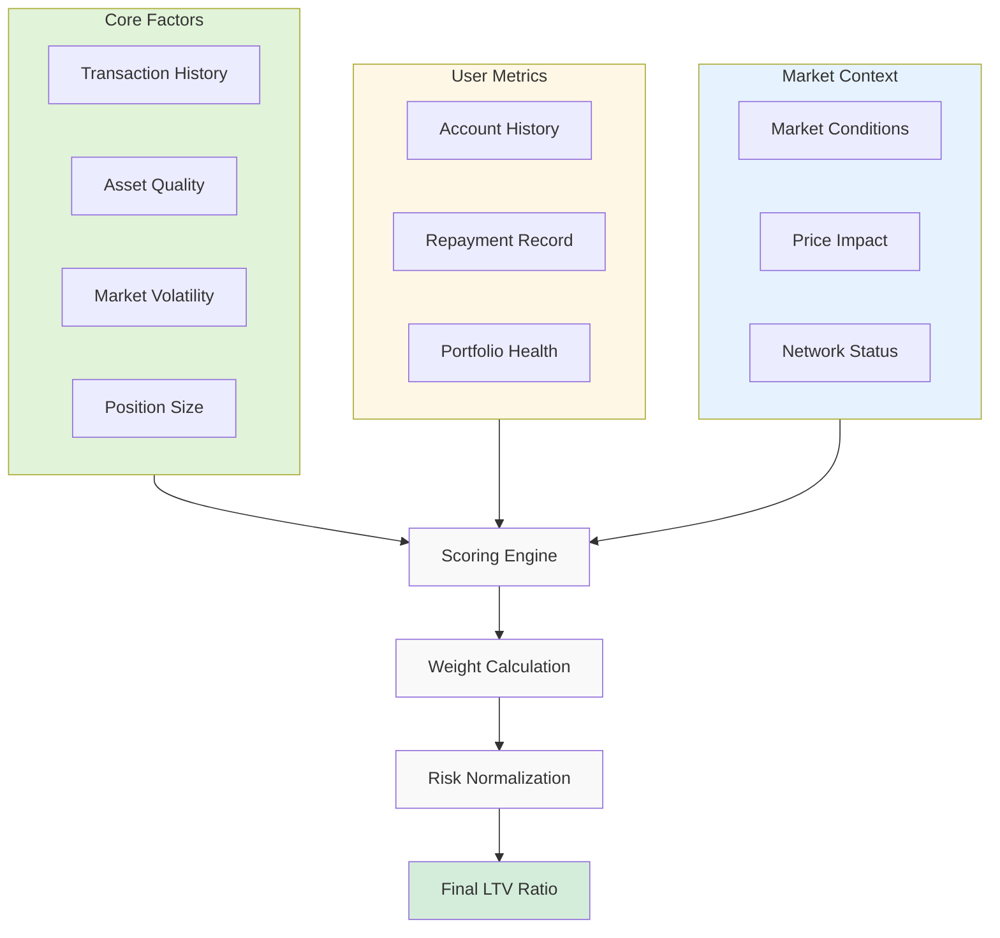
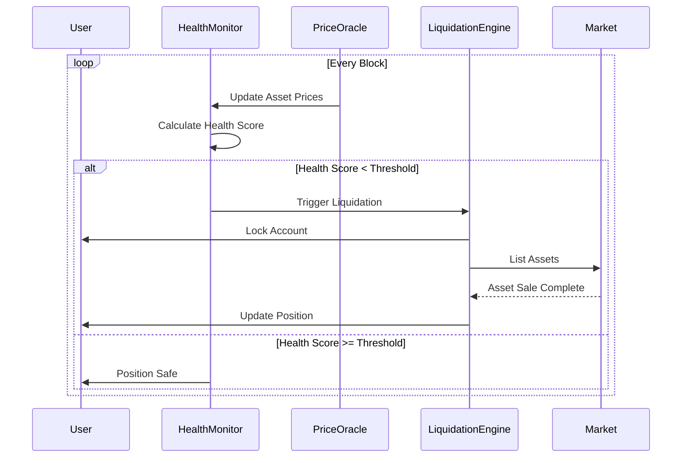
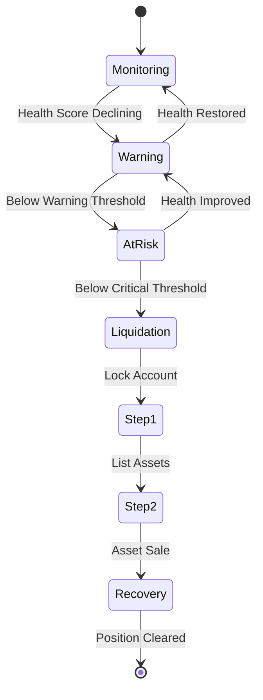
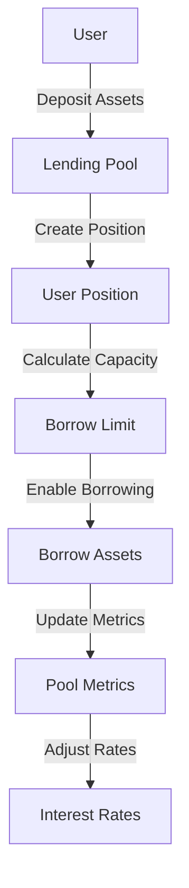
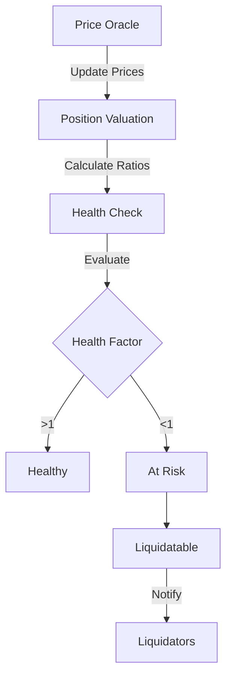

# How to Build a Bitcoin Lending Protocol

This guide walks through building a lending protocol for Bitcoin-based assets (BTC, Runes, Ordinals) on Arch Network. We'll create a decentralized lending platform similar to Aave, but specifically designed for Bitcoin-based assets.

## Prerequisites

Before starting, ensure you have:
- Completed the [environment setup](../getting-started/environment-setup.md)
- A basic understanding of [Bitcoin Integration](../concepts/bitcoin-integration.md)
- Familiarity with Rust programming language
- Your development environment ready with the Arch CLI installed

## System Overview

### Basic User Flow


### Safety System


### Simple Example
Let's say Alice wants to borrow BTC and Bob wants to earn interest:

1. **Bob (Lender)**
   - Deposits 1 BTC into pool
   - Earns 3% APY interest

2. **Alice (Borrower)**
   - Provides 1.5 BTC as collateral
   - Borrows 1 BTC
   - Pays 5% APY interest

3. **Safety System**
   - Monitors BTC price
   - Checks if Alice's collateral stays valuable enough
   - If BTC price drops too much, liquidates some collateral to protect Bob's deposit

## Architecture Overview

Our lending protocol consists of several key components:

### 1. Pool Accounts
Pool accounts are the core of our lending protocol. They serve as liquidity pools where users can:
- Deposit Bitcoin-based assets (BTC, Runes, Ordinals)
- Earn interest on deposits
- Borrow against their collateral
- Manage protocol parameters

Each pool account maintains:
- Total deposits and borrows
- Interest rates and utilization metrics
- Collateral factors and liquidation thresholds
- Asset-specific parameters

The pool account manages both state and UTXOs:
- **State Management**: Tracks deposits, withdrawals, and user positions
- **UTXO Management**: 
  - Maintains a collection of UTXOs for the pool's Bitcoin holdings
  - Manages UTXO creation for withdrawals
  - Handles UTXO consolidation for efficient liquidity management

### 2. Price Oracle
Track asset prices for liquidation calculations

### 3. User Positions
User positions track all user interactions with the lending pools:
- Active deposits and their earned interest
- Outstanding borrows and accrued interest
- Collateral positions and health factors
- Liquidation thresholds and warnings

Each user can have multiple positions across different pools, and the protocol tracks:
- Position health through real-time monitoring
- Collateralization ratios
- Interest accrual
- Liquidation risks

### Core Data Structures

```rust,ignore
#[derive(BorshSerialize, BorshDeserialize)]
pub struct LendingPool {
    pub pool_pubkey: Pubkey,
    pub asset_type: AssetType, // BTC, Runes, Ordinals
    pub total_deposits: u64,
    pub total_borrows: u64,
    pub interest_rate: u64,
    pub utilization_rate: u64,
    pub liquidation_threshold: u64,
    pub collateral_factor: u64,
    pub utxos: Vec<UtxoMeta>,
    pub validator_signatures: Vec<Signature>,
    pub min_signatures_required: u32,
}

#[derive(BorshSerialize, BorshDeserialize)]
pub struct UserPosition {
    pub user_pubkey: Pubkey,
    pub pool_pubkey: Pubkey,
    pub deposited_amount: u64,
    pub borrowed_amount: u64,
    pub collateral_amount: u64,
    pub last_update: i64,
}

#[derive(BorshSerialize, BorshDeserialize)]
pub struct InterestRateModel {
    pub base_rate: u64,
    pub multiplier: u64,
    pub jump_multiplier: u64,
    pub optimal_utilization: u64,
}

// Additional helper structures for managing positions
#[derive(BorshSerialize, BorshDeserialize)]
pub struct PositionHealth {
    pub health_factor: u64,
    pub liquidation_price: u64,
    pub safe_borrow_limit: u64,
}

#[derive(BorshSerialize, BorshDeserialize)]
pub struct PoolMetrics {
    pub total_value_locked: u64,
    pub available_liquidity: u64,
    pub utilization_rate: u64,
    pub supply_apy: u64,
    pub borrow_apy: u64,
}
```

## Custom Scoring and Risk Management

### LTV (Loan-to-Value) Scoring System



### Health Score Monitoring


### Liquidation Process


### Custom Scoring Implementation

```rust,ignore
#[derive(BorshSerialize, BorshDeserialize)]
pub struct UserScore {
    pub historical_data_score: u64,
    pub asset_quality_score: u64,
    pub market_volatility_score: u64,
    pub position_size_score: u64,
    pub account_age_score: u64,
    pub liquidation_history_score: u64,
    pub repayment_history_score: u64,
    pub cross_margin_score: u64,
    pub portfolio_diversity_score: u64,
    pub market_condition_score: u64,
    pub collateral_quality_score: u64,
    pub platform_activity_score: u64,
    pub time_weighted_score: u64,
    pub price_impact_score: u64,
    pub network_status_score: u64,
}

pub fn calculate_ltv_ratio(score: &UserScore) -> Result<u64> {
    // Weighted calculation of LTV based on all scoring parameters
    let weighted_score = calculate_weighted_score(score)?;
    let normalized_score = normalize_score(weighted_score)?;
    
    // Convert normalized score to LTV ratio
    let ltv_ratio = convert_score_to_ltv(normalized_score)?;
    
    // Apply market condition adjustments
    let adjusted_ltv = apply_market_adjustments(ltv_ratio)?;
    
    Ok(adjusted_ltv)
}

pub fn monitor_health_score(
    ctx: Context<HealthCheck>,
    position: &UserPosition,
    score: &UserScore,
) -> Result<()> {
    let health_score = calculate_health_score(position, score)?;
    
    if health_score < CRITICAL_THRESHOLD {
        trigger_full_liquidation(ctx, position)?;
        lock_account(ctx.accounts.user_account)?;
    } else if health_score < WARNING_THRESHOLD {
        emit_warning(ctx.accounts.user_account)?;
    }
    
    Ok(())
}

pub fn trigger_full_liquidation(
    ctx: Context<Liquidation>,
    position: &UserPosition,
) -> Result<()> {
    // Step 1: Lock the account
    lock_account(ctx.accounts.user_account)?;
    
    // Step 2: Calculate current position value
    let position_value = calculate_position_value(position)?;
    
    // Step 3: List assets on marketplace
    list_assets_for_liquidation(
        ctx.accounts.marketplace,
        position.assets,
        position_value,
    )?;
    
    // Step 4: Monitor recovery process
    start_recovery_monitoring(ctx.accounts.recovery_manager)?;
    
    Ok(())
}

### Health Score Calculation
The health score is calculated using a combination of factors:

```rust,ignore
pub fn calculate_health_score(
    position: &UserPosition,
    score: &UserScore,
) -> Result<u64> {
    // 1. Calculate base health ratio
    let base_health = calculate_base_health_ratio(
        position.collateral_value,
        position.borrowed_value,
    )?;
    
    // 2. Apply user score modifiers
    let score_adjusted_health = apply_score_modifiers(
        base_health,
        score,
    )?;
    
    // 3. Apply market condition adjustments
    let market_adjusted_health = apply_market_conditions(
        score_adjusted_health,
        &position.asset_type,
    )?;
    
    // 4. Apply time-weighted factors
    let final_health_score = apply_time_weights(
        market_adjusted_health,
        position.last_update,
    )?;
    
    Ok(final_health_score)
}
```

### Liquidation Implementation
The two-step liquidation process is implemented as follows:

```rust,ignore
pub struct LiquidationConfig {
    pub warning_threshold: u64,
    pub critical_threshold: u64,
    pub recovery_timeout: i64,
    pub minimum_recovery_value: u64,
}

pub fn handle_liquidation(
    ctx: Context<Liquidation>,
    config: &LiquidationConfig,
) -> Result<()> {
    // Step 1: Asset Recovery
    let recovery_listing = create_recovery_listing(
        ctx.accounts.marketplace,
        ctx.accounts.user_position,
        config.minimum_recovery_value,
    )?;
    
    // Step 2: Monitor Recovery
    start_recovery_monitoring(
        recovery_listing,
        config.recovery_timeout,
    )?;
    
    // Lock account until recovery complete
    lock_user_account(ctx.accounts.user_account)?;
    
    Ok(())
}
```

## Implementation Steps

### 1. Initialize Lending Pool

First, we'll create a function to initialize a new lending pool:

```rust,ignore
pub fn initialize_lending_pool(
    ctx: Context<InitializeLendingPool>,
    asset_type: AssetType,
    initial_interest_rate: u64,
    liquidation_threshold: u64,
    collateral_factor: u64,
) -> Result<()> {
    let lending_pool = &mut ctx.accounts.lending_pool;
    
    lending_pool.pool_pubkey = ctx.accounts.pool.key();
    lending_pool.asset_type = asset_type;
    lending_pool.total_deposits = 0;
    lending_pool.total_borrows = 0;
    lending_pool.interest_rate = initial_interest_rate;
    lending_pool.utilization_rate = 0;
    lending_pool.liquidation_threshold = liquidation_threshold;
    lending_pool.collateral_factor = collateral_factor;
    
    Ok(())
}

// Initialize pool metrics
pub fn initialize_pool_metrics(
    ctx: Context<InitializePoolMetrics>,
) -> Result<()> {
    let pool_metrics = &mut ctx.accounts.pool_metrics;
    
    pool_metrics.total_value_locked = 0;
    pool_metrics.available_liquidity = 0;
    pool_metrics.utilization_rate = 0;
    pool_metrics.supply_apy = 0;
    pool_metrics.borrow_apy = 0;
    
    Ok(())
}
```

### 2. Manage User Positions

Functions to handle user position management:

```rust,ignore
pub fn create_user_position(
    ctx: Context<CreateUserPosition>,
    pool_pubkey: Pubkey,
) -> Result<()> {
    let user_position = &mut ctx.accounts.user_position;
    
    user_position.user_pubkey = ctx.accounts.user.key();
    user_position.pool_pubkey = pool_pubkey;
    user_position.deposited_amount = 0;
    user_position.borrowed_amount = 0;
    user_position.collateral_amount = 0;
    user_position.last_update = Clock::get()?.unix_timestamp;
    
    Ok(())
}

pub fn update_position_health(
    ctx: Context<UpdatePositionHealth>,
) -> Result<()> {
    let position = &ctx.accounts.user_position;
    let pool = &ctx.accounts.lending_pool;
    let health = &mut ctx.accounts.position_health;
    
    // Calculate health factor based on current prices and positions
    let collateral_value = calculate_collateral_value(
        position.collateral_amount,
        pool.asset_type,
    )?;
    
    let borrow_value = calculate_borrow_value(
        position.borrowed_amount,
        pool.asset_type,
    )?;
    
    health.health_factor = calculate_health_factor(
        collateral_value,
        borrow_value,
        pool.collateral_factor,
    )?;
    
    health.liquidation_price = calculate_liquidation_price(
        position.borrowed_amount,
        position.collateral_amount,
        pool.liquidation_threshold,
    )?;
    
    health.safe_borrow_limit = calculate_safe_borrow_limit(
        collateral_value,
        pool.collateral_factor,
    )?;
    
    Ok(())
}
```

### 3. Pool and Position Utilities

Helper functions for managing pools and positions:

```rust,ignore
// Calculate the utilization rate of a pool
pub fn calculate_utilization_rate(pool: &LendingPool) -> Result<u64> {
    if pool.total_deposits == 0 {
        return Ok(0);
    }
    
    Ok((pool.total_borrows * 10000) / pool.total_deposits)
}

// Calculate the health factor of a position
pub fn calculate_health_factor(
    collateral_value: u64,
    borrow_value: u64,
    collateral_factor: u64,
) -> Result<u64> {
    if borrow_value == 0 {
        return Ok(u64::MAX);
    }
    
    Ok((collateral_value * collateral_factor) / (borrow_value * 10000))
}

// Update pool metrics
pub fn update_pool_metrics(
    pool: &LendingPool,
    metrics: &mut PoolMetrics,
) -> Result<()> {
    metrics.total_value_locked = pool.total_deposits;
    metrics.available_liquidity = pool.total_deposits.saturating_sub(pool.total_borrows);
    metrics.utilization_rate = calculate_utilization_rate(pool)?;
    
    // Update APY rates based on utilization
    let (supply_apy, borrow_apy) = calculate_apy_rates(
        metrics.utilization_rate,
        pool.interest_rate,
    )?;
    
    metrics.supply_apy = supply_apy;
    metrics.borrow_apy = borrow_apy;
    
    Ok(())
}
```

### 4. Deposit Assets

Create a deposit function to allow users to provide liquidity:

```rust,ignore
pub fn deposit(
    ctx: Context<Deposit>,
    amount: u64,
    btc_txid: [u8; 32],
    vout: u32,
) -> Result<()> {
    let pool = &mut ctx.accounts.lending_pool;
    let user_position = &mut ctx.accounts.user_position;
    
    // Verify the UTXO belongs to the user
    require!(
        verify_utxo_ownership(
            &ctx.accounts.user.key(),
            &btc_txid,
            vout
        )?,
        ErrorCode::InvalidUTXO
    );

    // Create deposit account to hold the UTXO
    invoke(
        &SystemInstruction::new_create_account_instruction(
            btc_txid,
            vout,
            pool.pool_pubkey,
        ),
        &[ctx.accounts.user.clone(), ctx.accounts.pool.clone()]
    )?;

    // Update pool state
    pool.total_deposits = pool.total_deposits
        .checked_add(amount)
        .ok_or(ErrorCode::MathOverflow)?;
    
    // Update user position
    user_position.deposited_amount = user_position.deposited_amount
        .checked_add(amount)
        .ok_or(ErrorCode::MathOverflow)?;
    
    // Update utilization metrics
    update_utilization_rate(pool)?;
    
    Ok(())
}
```

### 5. Borrow Assets

Implement borrowing functionality:

```rust,ignore
pub fn borrow(
    ctx: Context<Borrow>,
    amount: u64,
    collateral_utxo: UtxoMeta,
) -> Result<()> {
    let pool = &mut ctx.accounts.lending_pool;
    let borrower_position = &mut ctx.accounts.user_position;

    // Verify collateral UTXO ownership
    require!(
        verify_utxo_ownership(
            &ctx.accounts.borrower.key(),
            &collateral_utxo.txid,
            collateral_utxo.vout,
        )?,
        ErrorCode::InvalidCollateral
    );

    // Check collateral requirements
    require!(
        is_collateral_sufficient(borrower_position, pool, amount)?,
        ErrorCode::InsufficientCollateral
    );

    // Create collateral account
    invoke(
        &SystemInstruction::new_create_account_instruction(
            collateral_utxo.txid,
            collateral_utxo.vout,
            pool.pool_pubkey,
        ),
        &[ctx.accounts.borrower.clone(), ctx.accounts.pool.clone()]
    )?;

    // Create borrow UTXO for user
    let mut btc_tx = Transaction::new();
    add_state_transition(&mut btc_tx, ctx.accounts.pool);

    // Set transaction for validator signing
    set_transaction_to_sign(
        ctx.accounts,
        TransactionToSign {
            tx_bytes: &bitcoin::consensus::serialize(&btc_tx),
            inputs_to_sign: &[InputToSign {
                index: 0,
                signer: pool.pool_pubkey
            }]
        }
    );

    // Update states
    pool.total_borrows = pool.total_borrows
        .checked_add(amount)
        .ok_or(ErrorCode::MathOverflow)?;
    
    borrower_position.borrowed_amount = borrower_position.borrowed_amount
        .checked_add(amount)
        .ok_or(ErrorCode::MathOverflow)?;

    update_utilization_rate(pool)?;
    update_interest_rate(pool)?;

    Ok(())
}
```

### 6. Liquidation Logic

Implement liquidation for underwater positions:

```rust,ignore
pub fn liquidate(
    ctx: Context<Liquidate>,
    repay_amount: u64,
) -> Result<()> {
    let pool = &mut ctx.accounts.lending_pool;
    let liquidated_position = &mut ctx.accounts.liquidated_position;
    
    // Check if position is liquidatable
    require!(
        is_position_liquidatable(liquidated_position, pool)?,
        ErrorCode::PositionNotLiquidatable
    );
    
    // Calculate liquidation bonus
    let bonus = calculate_liquidation_bonus(repay_amount, pool.liquidation_threshold)?;
    
    // Process liquidation
    process_liquidation(
        pool,
        liquidated_position,
        repay_amount,
        bonus,
    )?;
    
    Ok(())
}
```

## Testing

Create comprehensive tests for your lending protocol:

```rust,ignore
#[cfg(test)]
mod tests {
    use super::*;

    #[test]
    fn test_initialize_lending_pool() {
        // Test pool initialization
    }

    #[test]
    fn test_deposit() {
        // Test deposit functionality
    }

    #[test]
    fn test_borrow() {
        // Test borrowing
    }

    #[test]
    fn test_liquidation() {
        // Test liquidation scenarios
    }
}
```

## Security Considerations

1. **Collateral Safety**: Implement strict collateral requirements and regular position health checks
2. **Price Oracle Security**: Use reliable price feeds and implement safeguards against price manipulation
3. **Interest Rate Model**: Ensure the model can handle extreme market conditions
4. **Access Control**: Implement proper permission checks for all sensitive operations
5. **Liquidation Thresholds**: Set appropriate thresholds to maintain protocol solvency

## Next Steps

1. Implement additional features:
   - Flash loans
   - Multiple collateral types
   - Governance mechanisms
   
2. Deploy and test on testnet:
   - Monitor pool performance
   - Test liquidation scenarios
   - Validate interest rate model

3. Security audit:
   - Contract review
   - Economic model analysis
   - Risk assessment

## Process Descriptions

### 1. Pool Initialization Process
The pool initialization process involves several steps:

```mermaid
%%{init: {
  'theme': 'base',
  'themeVariables': { 'fontSize': '16px'},
  'flowchart': {
    'curve': 'basis',
    'nodeSpacing': 50,
    'rankSpacing': 50,
    'animation': {
      'sequence': true,
      'duration': 1000,
      'ease': 'linear',
      'diagramUpdate': 200
    }
  }
}}%%
graph LR
    A[Admin] -->|Create Pool| B[Initialize Pool Account]
    B -->|Set Parameters| C[Configure Pool]
    C -->|Initialize Metrics| D[Create Pool Metrics]
    D -->|Enable Oracle| E[Connect Price Feed]
    E -->|Activate| F[Pool Active]

    classDef default fill:#f9f9f9,stroke:#333,stroke-width:2px;
    classDef active fill:#4a9eff,color:white,stroke:#3182ce,opacity:0;
    classDef complete fill:#98FB98,stroke:#333;

```



1. Admin creates a new pool account
2. Pool parameters are set (interest rates, thresholds)
3. Pool metrics are initialized
4. Price oracle connection is established
5. Pool is activated for user operations

### 2. Deposit and Borrow Flow
The lending and borrowing process follows this sequence:



Key steps:
1. User deposits assets into the pool
2. System creates or updates user position
3. Calculates borrowing capacity based on collateral
4. Enables borrowing up to the limit
5. Updates pool metrics and interest rates

### 3. Health Monitoring System
Continuous health monitoring process:



The system:
1. Continuously monitors asset prices
2. Updates position valuations
3. Calculates health factors
4. Triggers liquidations when necessary

### Withdrawal Process

The withdrawal process in our lending protocol involves two key components:
1. State management through program accounts
2. Actual BTC transfer through UTXOs

```rust,ignore
#[derive(BorshSerialize, BorshDeserialize)]
pub struct WithdrawRequest {
    pub user_pubkey: Pubkey,
    pub pool_pubkey: Pubkey,
    pub amount: u64,
    pub recipient_btc_address: String,
}

pub fn process_withdrawal(
    ctx: Context<ProcessWithdraw>,
    request: WithdrawRequest,
) -> Result<()> {
    let pool = &mut ctx.accounts.lending_pool;
    let user_position = &mut ctx.accounts.user_position;

    // 1. Validate user position
    require!(
        user_position.deposited_amount >= request.amount,
        ErrorCode::InsufficientBalance
    );

    // 2. Check pool liquidity
    require!(
        pool.available_liquidity() >= request.amount,
        ErrorCode::InsufficientLiquidity
    );

    // 3. Find available UTXOs from pool
    let selected_utxos = select_utxos_for_withdrawal(
        &pool.utxos,
        request.amount
    )?;

    // 4. Create Bitcoin withdrawal transaction
    let mut btc_tx = Transaction::new();
    
    // Add inputs from selected UTXOs
    for utxo in selected_utxos {
        btc_tx.input.push(TxIn {
            previous_output: OutPoint::new(utxo.txid, utxo.vout),
            script_sig: Script::new(),
            sequence: Sequence::MAX,
            witness: Witness::new(),
        });
    }

    // Add withdrawal output to user's address
    let recipient_script = Address::from_str(&request.recipient_btc_address)?
        .script_pubkey();
    btc_tx.output.push(TxOut {
        value: request.amount,
        script_pubkey: recipient_script,
    });

    // Add change output back to pool if needed
    let total_input = selected_utxos.iter()
        .map(|utxo| utxo.amount)
        .sum::<u64>();
    if total_input > request.amount {
        btc_tx.output.push(TxOut {
            value: total_input - request.amount,
            script_pubkey: get_account_script_pubkey(&pool.pool_pubkey),
        });
    }

    // 5. Set transaction for validator signing
    set_transaction_to_sign(
        ctx.accounts,
        TransactionToSign {
            tx_bytes: &bitcoin::consensus::serialize(&btc_tx),
            inputs_to_sign: &selected_utxos.iter()
                .enumerate()
                .map(|(i, _)| InputToSign {
                    index: i as u32,
                    signer: pool.pool_pubkey,
                })
                .collect::<Vec<_>>()
        }
    );

    // 6. Update pool state
    pool.total_deposits = pool.total_deposits
        .checked_sub(request.amount)
        .ok_or(ErrorCode::MathOverflow)?;

    // 7. Update user position
    user_position.deposited_amount = user_position.deposited_amount
        .checked_sub(request.amount)
        .ok_or(ErrorCode::MathOverflow)?;

    // 8. Remove spent UTXOs from pool
    pool.utxos.retain(|utxo| !selected_utxos.contains(utxo));

    Ok(())
}

fn select_utxos_for_withdrawal(
    pool_utxos: &[UtxoMeta],
    amount: u64,
) -> Result<Vec<UtxoMeta>> {
    let mut selected = Vec::new();
    let mut total_selected = 0;

    for utxo in pool_utxos {
        if total_selected >= amount {
            break;
        }
        
        // Verify UTXO is still valid and unspent
        validate_utxo(utxo)?;
        
        selected.push(utxo.clone());
        total_selected += utxo.amount;
    }

    require!(
        total_selected >= amount,
        ErrorCode::InsufficientUtxos
    );

    Ok(selected)
}
```

   