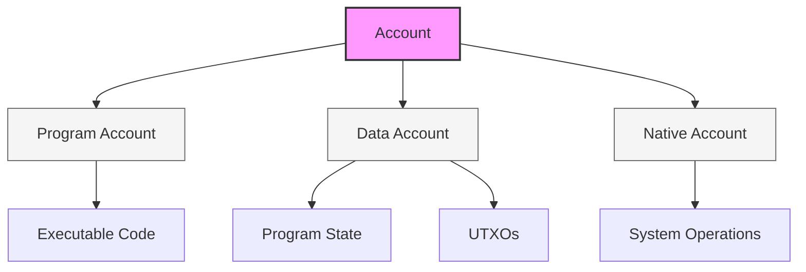
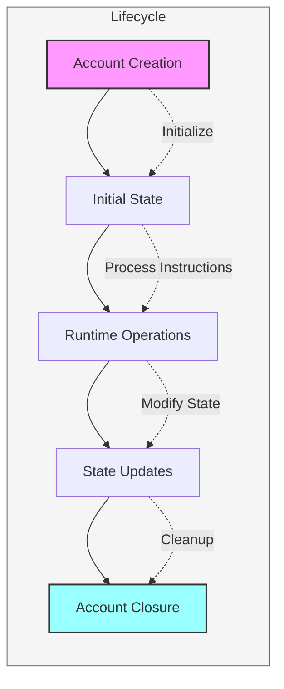

# Account Guide

> **Navigation**: [Reference](../SUMMARY.md#reference) → [Program](./program.md) → Account Guide
>
> For the core account structure and data types, see [Account Structure](./account.md).

Accounts are the fundamental building blocks for state management and program interaction in Arch Network. They serve as containers for both program code and state data, bridging the gap between Bitcoin's UTXO model and modern programmable state machines.

> **Note**: For detailed documentation on core system functions used to interact with accounts (like `invoke`, `new_create_account_instruction`, `add_state_transition`, and `set_transaction_to_sign`), see [System Functions](./system-functions.md).



## Core Concepts

### Account Fundamentals
Every account in Arch Network is uniquely identified by a public key (pubkey) and contains four essential components:

```rust,ignore
pub struct Account {
    /// The program that owns this account
    pub owner: Pubkey,
    /// Number of lamports assigned to this account
    pub lamports: u64,
    /// Data held in this account
    pub data: Vec<u8>,
    /// Whether this account can process instructions
    pub executable: bool,
}
```

#### Component Details:

1. **Owner (Pubkey)**
   - Controls account modifications
   - Determines which program can modify data
   - Can be transferred to new programs
   - Required for all accounts

2. **Lamports (u64)**
   - Native token balance
   - Used for:
     * Transaction fees
     * Rent payments
     * State storage costs
     * Program execution fees

3. **Data (Vec<u8>)**
   - Flexible byte array for state storage
   - Common uses:
     * Program code (if executable)
     * Program state
     * UTXO metadata
     * Configuration data
   - Size determined at creation

4. **Executable Flag (bool)**
   - Determines if account contains program code
   - Immutable after deployment
   - Controls instruction processing capability



## Account Types & Use Cases

### 1. Program Accounts
Program accounts contain executable code and form the backbone of Arch Network's programmable functionality.

```rust,ignore
// Example program account creation
let program_account = SystemInstruction::CreateAccount {
    lamports: rent.minimum_balance(program_data.len()),
    space: program_data.len() as u64,
    owner: bpf_loader::id(),  // BPF Loader owns program accounts
    executable: true,
    data: program_data,
};
```

Key characteristics:
- Immutable after deployment
- Owned by BPF loader
- Contains verified program code
- Processes instructions

### 2. Data Accounts
Data accounts store program state and user data. They're highly flexible and can be structured to meet various needs.

```rust,ignore
// Example data structure for a game account
#[derive(BorshSerialize, BorshDeserialize)]
pub struct GameAccount {
    pub player: Pubkey,
    pub score: u64,
    pub level: u8,
    pub achievements: Vec<Achievement>,
    pub last_played: i64,
}

// Creating a data account
let game_account = SystemInstruction::CreateAccount {
    lamports: rent.minimum_balance(size_of::<GameAccount>()),
    space: size_of::<GameAccount>() as u64,
    owner: game_program::id(),
    executable: false,
    data: Vec::new(),  // Will be initialized by program
};
```

Common use cases:
- Player profiles
- Game state
- DeFi positions
- NFT metadata
- Configuration settings

### 3. UTXO Accounts
Special data accounts that bridge Bitcoin UTXOs with Arch Network state.

```rust,ignore
#[derive(BorshSerialize, BorshDeserialize)]
pub struct UtxoAccount {
    pub meta: UtxoMeta,
    pub owner: Pubkey,
    pub delegate: Option<Pubkey>,
    pub state: UtxoState,
    pub created_at: i64,
    pub last_updated: i64,
    pub constraints: Vec<UtxoConstraint>,
}

// Example UTXO account creation
let utxo_account = SystemInstruction::CreateAccount {
    lamports: rent.minimum_balance(size_of::<UtxoAccount>()),
    space: size_of::<UtxoAccount>() as u64,
    owner: utxo_program::id(),
    executable: false,
    data: Vec::new(),
};
```

## Account Interactions

Account interactions in Arch Network are facilitated through a set of core system functions. These functions handle everything from account creation to state transitions and are documented in detail in [System Functions](./system-functions.md). Below are common patterns for account interactions:

### 1. Creation Patterns

```rust,ignore
// 1. Basic account creation
pub fn create_basic_account(
    payer: &Keypair,
    space: u64,
    owner: &Pubkey,
) -> Result<Keypair, Error> {
    let account = Keypair::new();
    let rent = banks_client.get_rent().await?;
    let lamports = rent.minimum_balance(space as usize);
    
    let ix = system_instruction::create_account(
        &payer.pubkey(),
        &account.pubkey(),
        lamports,
        space,
        owner,
    );
    
    let tx = Transaction::new_signed_with_payer(
        &[ix],
        Some(&payer.pubkey()),
        &[payer, &account],
        recent_blockhash,
    );
    
    banks_client.process_transaction(tx).await?;
    Ok(account)
}

// 2. PDA (Program Derived Address) creation
pub fn create_pda_account(
    program_id: &Pubkey,
    seeds: &[&[u8]],
    space: u64,
) -> Result<Pubkey, Error> {
    let (pda, bump) = Pubkey::find_program_address(seeds, program_id);
    
    let ix = system_instruction::create_account(
        &payer.pubkey(),
        &pda,
        lamports,
        space,
        program_id,
    );
    
    // Include the bump seed for deterministic address
    let seeds_with_bump = &[&seeds[..], &[&[bump]]].concat();
    let signer_seeds = &[&seeds_with_bump[..]];
    
    invoke_signed(&ix, &[payer, pda], signer_seeds)?;
    Ok(pda)
}
```

### 2. State Management

```rust,ignore
// Example of managing account state
pub trait AccountState: Sized {
    fn try_from_slice(data: &[u8]) -> Result<Self, Error>;
    fn try_serialize(&self) -> Result<Vec<u8>, Error>;
    
    fn load(account: &AccountInfo) -> Result<Self, Error> {
        Self::try_from_slice(&account.data.borrow())
    }
    
    fn save(&self, account: &AccountInfo) -> Result<(), Error> {
        let data = self.try_serialize()?;
        let mut account_data = account.data.borrow_mut();
        account_data[..data.len()].copy_from_slice(&data);
        Ok(())
    }
}

// Implementation example
impl AccountState for GameAccount {
    fn update_score(&mut self, new_score: u64) -> Result<(), Error> {
        self.score = new_score;
        self.last_played = Clock::get()?.unix_timestamp;
        Ok(())
    }
}
```

### 3. Cross-Program Invocation (CPI)

```rust,ignore
// Example of one program calling another
pub fn process_instruction(
    program_id: &Pubkey,
    accounts: &[AccountInfo],
    instruction_data: &[u8],
) -> ProgramResult {
    // Deserialize accounts
    let account_info_iter = &mut accounts.iter();
    let source_info = next_account_info(account_info_iter)?;
    let dest_info = next_account_info(account_info_iter)?;
    let system_program = next_account_info(account_info_iter)?;
    
    // Create CPI context
    let cpi_accounts = Transfer {
        from: source_info.clone(),
        to: dest_info.clone(),
    };
    let cpi_program = system_program.clone();
    let cpi_ctx = CpiContext::new(cpi_program, cpi_accounts);
    
    // Perform cross-program invocation
    transfer(cpi_ctx, amount)?;
    
    Ok(())
}
```

## Security Considerations

### 1. Access Control
```rust,ignore
fn verify_account_access(
    account: &AccountInfo,
    expected_owner: &Pubkey,
    writable: bool,
) -> ProgramResult {
    // Check account ownership
    if account.owner != expected_owner {
        return Err(ProgramError::IncorrectProgramId);
    }
    
    // Verify write permission if needed
    if writable && !account.is_writable {
        return Err(ProgramError::InvalidAccountData);
    }
    
    // Additional checks...
    Ok(())
}
```

### 2. Data Validation
```rust,ignore
fn validate_account_data<T: AccountState>(
    account: &AccountInfo,
    validate_fn: impl Fn(&T) -> bool,
) -> ProgramResult {
    // Load and validate account data
    let data = T::load(account)?;
    if !validate_fn(&data) {
        return Err(ProgramError::InvalidAccountData);
    }
    Ok(())
}
```

## Best Practices

### 1. Account Management
- Always validate account ownership before modifications
- Use PDAs for deterministic addresses
- Implement proper error handling
- Close unused accounts to reclaim rent

### 2. Data Safety
- Validate all input data
- Use proper serialization
- Handle account size limits
- Implement atomic operations

### 3. Performance
- Minimize account creations
- Batch operations when possible
- Use appropriate data structures
- Cache frequently accessed data

### 4. Upgrades
- Plan for version management
- Implement migration strategies
- Use flexible data structures
- Document state changes

## Common Patterns

### 1. Account Initialization
```rust,ignore
pub fn initialize_account<T: AccountState>(
    program_id: &Pubkey,
    account: &AccountInfo,
    initial_state: T,
) -> ProgramResult {
    // Verify account is uninitialized
    if !account.data_is_empty() {
        return Err(ProgramError::AccountAlreadyInitialized);
    }
    
    // Set account owner
    account.set_owner(program_id)?;
    
    // Initialize state
    initial_state.save(account)?;
    
    Ok(())
}
```

### 2. Account Updates
```rust,ignore
pub fn update_account<T: AccountState>(
    account: &AccountInfo,
    update_fn: impl FnOnce(&mut T) -> ProgramResult,
) -> ProgramResult {
    // Load current state
    let mut state = T::load(account)?;
    
    // Apply update
    update_fn(&mut state)?;
    
    // Save updated state
    state.save(account)?;
    
    Ok(())
}
```

### 3. Account Closure
```rust,ignore
pub fn close_account(
    account: &AccountInfo,
    destination: &AccountInfo,
) -> ProgramResult {
    // Transfer lamports
    let dest_starting_lamports = destination.lamports();
    **destination.lamports.borrow_mut() = dest_starting_lamports
        .checked_add(account.lamports())
        .ok_or(ProgramError::Overflow)?;
    **account.lamports.borrow_mut() = 0;
    
    // Clear data
    account.data.borrow_mut().fill(0);
    
    Ok(())
}
```

## Related Topics
- [UTXOs](./utxo.md) - How UTXOs integrate with accounts
- [Programs](./program.md) - Programs that own and modify accounts
- [Instructions](./instructions-and-messages.md) - How to interact with accounts

<!-- Internal -->
[programs]: ./program.md
[program]: ./program.md
[pubkey]: ./pubkey.md
[instructions]: ./instructions-and-messages.md
[UTXO]: ./utxo.md